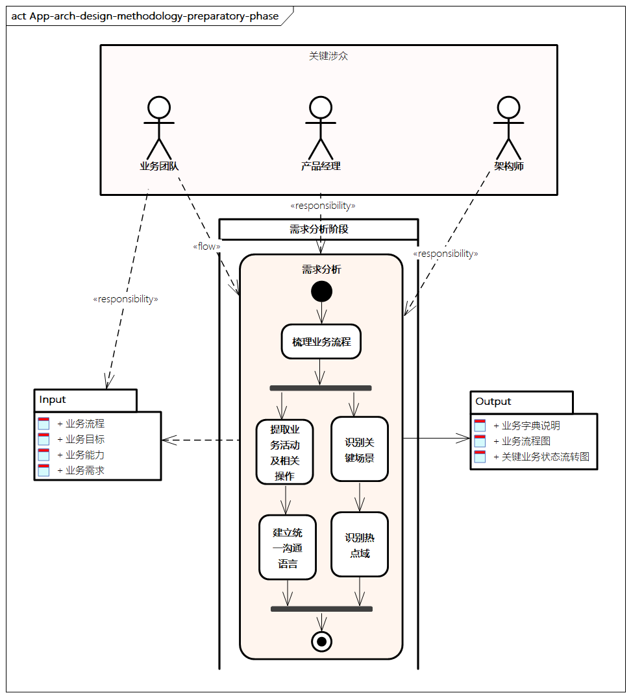
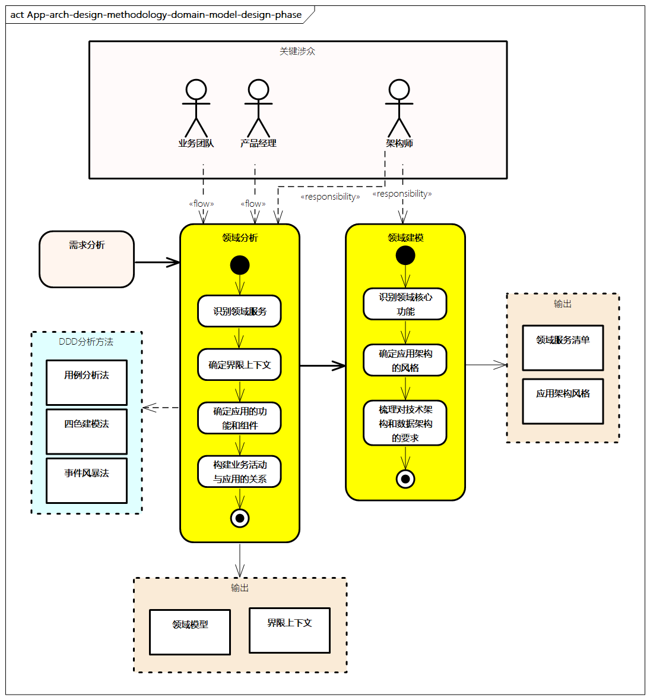
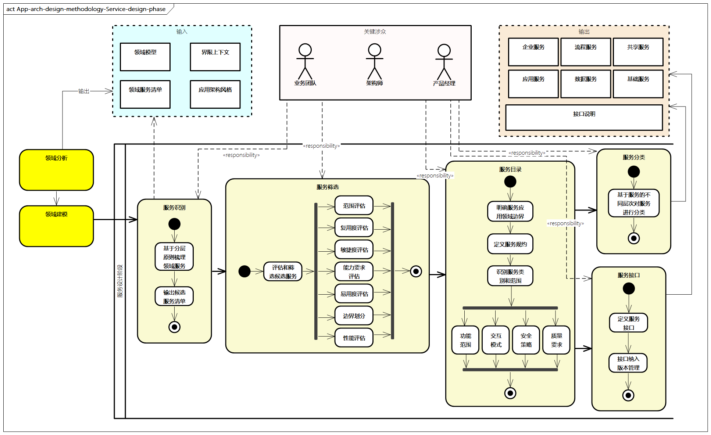

# 应用架构的设计方法

下面我们来看看应用架构的设计方法。应用架构的设计大概分为以下几个阶段。

## 阶段1：需求分析

> 图例：应用架构设计-需求分析阶段

本阶段的主要工作就是进行需求分析。

通过业务架构中的业务能力与业务流程，进一步梳理业务流程，提取业务活动及相关操作。这个阶段要和业务团队紧密合作，了解真实的业务流程和业务需求，并通过业务语言建立统一的沟通语言，确定相关的流程图、状态图，对可能的业务域及相关的业务能力进行描述，识别关键场景和热点域。同时，要多方面收集信息，收集信息时可以从局部到整体或者从整体到局部，尽量将各域的关键信息都收集到。

## 阶段2：领域模型设计

> 图例：应用架构设计-领域模式设计阶段

通过DDD，结合第一阶段的需求分析，整理收集到的关键信息，并通过DDD的用例分析法、四色建模法或者事件风暴法，初步识别领域服务及相关的界限上下文等关键信息，进而得出初步的领域模型。在此过程中，分析应用相关的业务功能和应用组件，构建业务活动与应用的关系，建立映射，进而通过领域建模，识别核心领域功能、领域模型，分析应用架构的风格，并初步梳理应用架构对技术架构和数据架构的风格要求。

## 阶段3：服务设计

> 图例：应用架构设计-服务设计阶段

服务设计主要包括服务识别、服务筛选、服务目录、服务分类、服务接口等。

- **服务识别**：基于领域识别的服务，初步基于分层原则进行梳理，如服务之间的依赖关系、独立原则，作为候选服务列表。
- **服务筛选**：对候选服务进行评估和筛选，可以从范围、复用度、敏捷度、能力要求、易用度、边界、风险、性能等多维度考虑。
- **服务目录**：定义服务应用领域，定义服务和应用的边界，定义服务规约，识别服务类别和范围，如功能范围、安全策略、交互模式、质量要求等。
- **服务分类**：根据服务的不同层次对服务进行分类，可以分为企业服务、应用服务、流程服务、数据服务、共享服务、微服务、集成服务等。
- **服务接口**：进行服务的接口描述，为实现做指引。将抽象出来的业务服务进行接口化梳理，需要做到职责单一、进行版本管理等。

## 阶段4：应用架构初步设计

此阶段进一步从整体分析应用架构。通过整体的一张图体现系统核心应用的分布，以及它们之间的交互关系，为后续数据架构和技术架构作为重要的输入。

这时候，我们得到了初步的应用架构，接着可以进一步分析现状应用架构和目标应用架构，此时不用关注如何实现这个过渡，重点是明确当前和未来，进而我们可以通过架构委员会，对应用架构进行整体的评估，并且可以邀请相关的业务和技术专家参与。

我们要重点分析应用架构的各个组成要素，现状应用架构和目标应用架构，领域模型和服务设计是否合理，是否可以指引后续架构和项目的进行，使得企业所有人员可以清晰地了解应用架构的定位与发展方向。

## 阶段5：优化迭代

> 图例：应用架构设计方法-优化迭代阶段

应用架构需要不断地迭代和优化，因为应用架构涉及系统的方方面面，连接着业务和技术，在这个过程中我们很容易有考虑不周之处，这就需要制订一个迭代的计划，同时需要包含架构治理层面，如用架构的评估和激励机制加以支持。

此外，从服务生命周期的完整性角度来说，除了服务设计，还涉及计划、设计、实现、测试、发布、运行、升级、弃用等生命周期。下面补充一些环节，大部分需要在后续章节的技术架构部分加以考虑。

- **服务实现**：通过DDD、微服务或者云原生方式，进行服务的实现，并考虑服务接口、版本、协议，以及服务开发、测试等流程。
- **服务注册**：注册中心的协调，如注册中心与服务消费者、提供者之间的同步及问题排查等，确保相关的数据一致。
- **服务组合**：通过对服务进行编排，构建组合服务或者流程服务，实现企业的业务流程，或者通过更友好的界面配置等低代码能力简化实现。
- **服务发布**：服务对外发布，包括服务注册极限的管理，通过服务注册中心使得服务提供者和消费者可以进行交互。此过程包括灰度发布、滚动发布等发布形态。
- **服务部署**：将服务部署到运行环境中，可以采用静态或者动态部署方式，并且需要考虑系统的资源，包括扩容、版本管理、升级策略等。
- **服务监控**：监控服务的健康状况，如服务链路情况、基础资源情况等，对服务的安全性、性能和可用性进行服务追踪、性能优化、一致性和兼容性管理。
- **服务测试**：测试服务的功能性和非功能性指标。
- **服务终结**：服务的最后一个状态，不仅需要更新注册中心中服务的状态，还需要考虑终结的节奏，比如灰度分批，并与业务方沟通好。
- **服务治理**：包括服务新增、修改、删除等版本管理，对应的升级替换管理，以及服务质量保障，如提供服务的SLA管理、部署和验收、集成管理等。
- **服务安全**：对服务进行必要的访问控制、鉴权控制及必要的数据保护等。

在应用架构设计过程中，可以采用一些理论和工具，如DDD、ArchiMate、UML（统一建模语言）等。

不过，应用架构的重点是进行应用功能和服务能力的识别，最终的结果可以借助文档、绘图工具，我们可以选择通用的架构设计工具，如EA、Archi等。
