# 领域驱动设计

在应用架构的设计中，领域驱动设计（`Domain Driven Design`，`DDD`）占据着非常重要的位置，可以说`DDD`是应用架构设计的核心。

`DDD`为我们提供了一种架构设计方法，既面向业务，又面向技术，从业务需求到领域建模，从领域服务到技术转化，强调开发人员与领域专家协同。`DDD`是埃里克·埃文斯（Eric Evans）在2003年出版的《领域驱动设计：软件核心复杂性应对之道》（`Domain Driven Design: Tackling Complexity in the Heart of Software`）一书中提出的具有划时代意义的重要概念，不过这种领域建模和设计的思想其实早在20世纪就有很多设计人员重视起来。`DDD`通过统一语言、领域模型、领域划分和服务划分等一系列手段来降低软件复杂度。

`DDD`的核心思想是业务与技术相结合的一种过程，既强调业务的理解，又强调应用领域建模方法的使用。`DDD`本质上是面向对象分析的扩展和延伸，它基于面向对象分析技术进行了分层规划，同时对其中的核心概念和划分做了详细的指引。

## DDD的价值

DDD对应用架构设计有非常大的指导作用，具体如下所示。

- **统一语言**：团队成员会在有界的上下文中有意识地形成统一语言，便于沟通，减少分歧，以一种所有干系人都能理解的通用语言为相互交流的工具，在交流的过程中形成领域概念，然后将这些概念设计成领域模型。
- **业务知识沉淀**：DDD不以人为中心，而**以业务为中心**，通过承接业务架构的业务流程和业务能力，并且通过领域知识进行转化，进而反哺业务架构和应用架构。
- **边界清晰的应用服务划分**：用领域模型划分**边界来界定哪些需求是合理的**，一些需求应该在什么地方实现，不断拉齐团队成员对需求的认知，让设计更加清晰和规范，分而治之，控制规模。
- **关注点分离**：**领域模型与数据模型分离，业务复杂度与技术复杂度分离**，保持结构清晰，以应对不可预测性挑战。
- **团队协同**：**业务人员和设计人员共同参与**，这样有助于创建大家都能理解的通用模型，并用该模型来沟通业务需求、数据实体和过程模型。
- **模型可扩展**：很好地对业务需求进行了到领域服务的转化，同时是微服务及项目落地开发的纽带，领域模型是可扩展且易维护的，也提高了相应的可重用性和可测试性。

当然DDD也不是万能的，在采用DDD之前，我们**需要考虑是否真正需要**，思考以下几个问题可以帮助我们做出判断。

- 是否以数据为中心，所有操作都是数据库CRUD？
- 业务逻辑是否只是少量的业务场景和用例？
- 应用功能是否稳定？
- 是否已经对业务领域足够了解？

如果以上问题的答案基本都是“**是**”，说明系统并没有复杂的业务逻辑，则可以用一般的面向数据的架构或者事务脚本等模式。但**如果业务逻辑复杂、变化频繁、团队对该领域还缺乏一定的认知，需要进行领域模型和服务的梳理，那么DDD会帮助我们抽象和解决问题。**

## DDD的设计理念

DDD大体的分析过程中，其中比较关键的几个切入点是通用语言、领域、限界上下文。

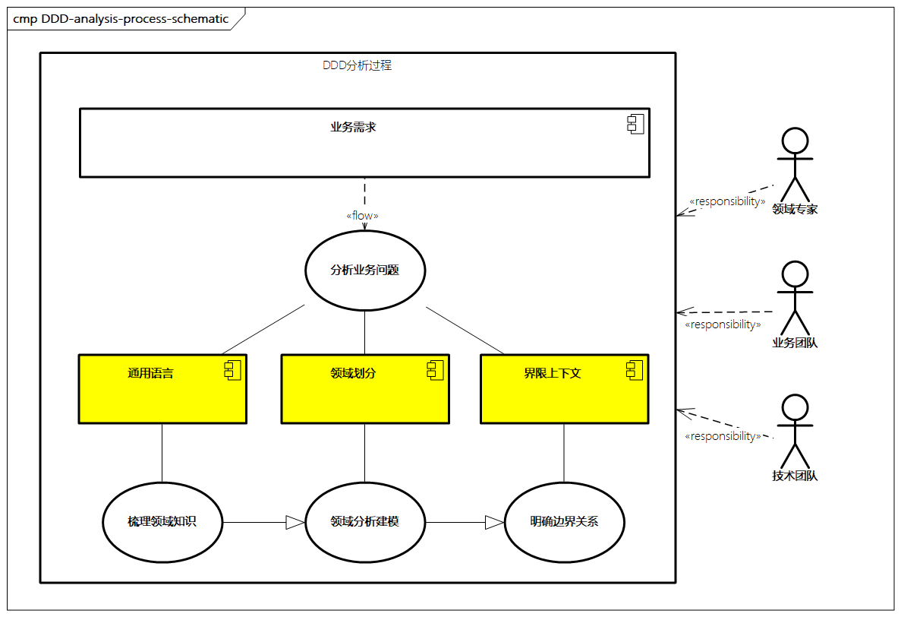

> 图例：DDD分析过程

### 通用语言（Ubiquitous Language）

业务人员和技术人员在协作过程中，如何讲同一种语言？在DDD中用通用语言来解决。**通用语言是理解业务需求和梳理领域知识的过程，也是团队中各个角色就系统目标、范围与具体功能达成一致的过程**。通用语言可以定义公共术语，减少概念混淆，消除歧义和理解偏差，提升需求和知识消化的效率，**达到概念和代码的统一**，使得虚拟概念和具体实现一致。

通用语言可能由团队所有相关角色参加，如业务代表、产品经理、业务架构师、技术架构师、开发人员。同时，领域专家也非常关键，领域专家需要对业务领域非常了解，或者能够跟领域专业人员学习到足够的领域知识。

通用语言建立的过程并不容易，因为技术人员和领域专家在沟通过程中存在“天然屏障”：

- 技术人员考虑的是类、方法、算法、继承、封装、代码等
- 领域专家考虑的是订单流程、库存状态、商品类目等

因此，**在建立领域知识的时候，双方必须交换知识，彼此深度参与，才可能得出领域模型**。知识的范围涉及领域模型的各个元素，如果一方感到困惑，那么应该立刻换一种方式，直到双方能够理解一致。

## 领域（Domain）

领域是用于确定范围和边界的，DDD将业务上的问题限定归属在特定的边界内，而这些边界就可以叫作领域。为了降低业务理解和系统实现的复杂度，DDD会将领域进一步划分为更细粒度，也就是子域。子域根据自身的重要程度和功能属性又可以划分为三类子域。

- **核心域**：**决定应用和系统核心竞争力，它是决定业务是否成功的主要因素**，比如电商系统中关注的会员、商品、订单、交易、库存、营销等。
- **通用域**：**没有太多个性化的诉求，同时被多个子域使用的通用功能子域是通用域**，比如统一的认证和权限管理系统。
- **支撑域**：**既不包含核心竞争力的功能，又不包含通用功能的子域，但该功能子域又是必需的，也就是支撑域**，比如某个特定领域的数据字典。

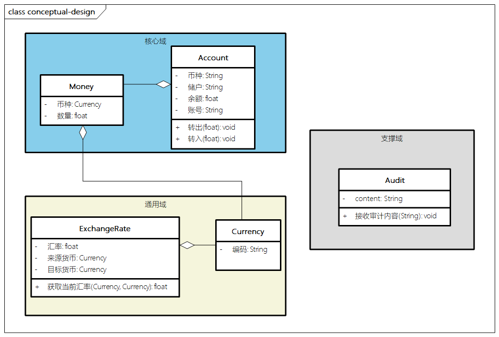

> 图例：DDD子域结构示例

领域中的核心是领域模型（Domain Model），**领域模型具备自己的属性行为状态，并与现实世界的业务对象相映射，领域模型之间具备明确的职责划分，领域对象元素之间通过聚合和引用来关联相应的业务规则，同时反映通用语言中的领域知识**。

**领域模型通过提炼领域对象，定义领域对象之间的关系、属性和行为，属于DDD的核心产物**。

## 限界上下文（Bounded Context）

领域帮助我们对系统进行拆分，而限界上下文帮助回答各领域之间的边界及它们如何交互。

> DDD中有一个形象的比喻，“**细胞之所以会存在，是因为细胞膜定义了什么在细胞内、什么在细胞外，并且确定了什么物质可以通过细胞膜**”。

这个“细胞膜”就是对限界上下文很形象的举例。

> 再举个例子，我们在平时的人际沟通中，为了避免同样的词语产生歧义，我们会把这个词语带入语言上下文中去理解其语义。比如，当谈到“苹果”时，有的人可能想到平时吃的水果，而有的人可能想到苹果手机。

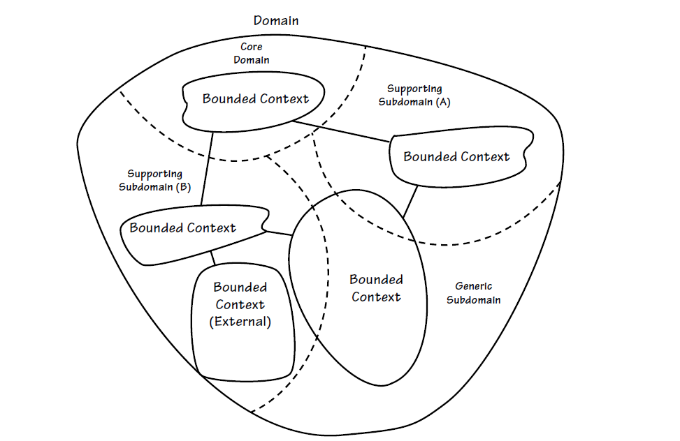
> 图例：DDD领域与限界上下文

限界上下文是一个显式的边界，领域模型便存在于这个边界之内，通用语言必须限制在这个限界上下文之中。在微服务设计中，一般一个限界上下文理论上就可以设计为一个微服务。限界上下文对应用的边界交互有重要作用，可以帮助我们保持模型的一致性，避免边界之外问题的混淆。这一点很重要，因为在大多数组织中，某些术语在不同的业务领域或团队中有不同的含义。

在限界上下文中，通过上下文映射图（Context Map）确立上下文之间的关系，通过上下游来表达依赖，最后形成限界上下文如何在应用程序中相互配合的全局视图。上下文的交互方法有多种，在实际工作中，目前使用比较广的是防腐层和统一协议。

- **已发布的语言（Published Language）**：两个上下文使用共同的语言，比如SOA服务总线定义了一堆XML模型，或者基于共享的文件或数据库，上下文可以基于此进行直接交互。
- **开放主机服务（Open Host）**：又叫统一协议，为上下文之间的服务定义一套包含标准化数据结构在内的协议，比如基于HTTP风格的RESTful接口协议。
- **共享内核（Shared Kernel）**：两个上下文使用一个共同的代码内核作为通用语言，比如两个工程使用同一个Bean基础模型库。
- **客户/供应商（Customer/Supplier）**：一个上下文使用另一个上下文的服务，有显著的上下游依赖关系，比如基于RPC的服务交互方式。
- **顺从者（Conformist）**：一个上下文使用另一个上下文的服务，但彼此之间的关系并不紧密，比如基于消息传递机制的交互模式。
- **防腐层（Anti-Corruption Layer，ACL）**：使用一层适配层来协助上下文的交互，隔离业务逻辑，比如在商品子域和采购子域之间提供防腐层，将商品的变更进行收口，隔离子域内的后端业务实现。

这里先就领域和限界上下文举一个简单的例子，此处举一个关于购物车订单支付下单的例子。

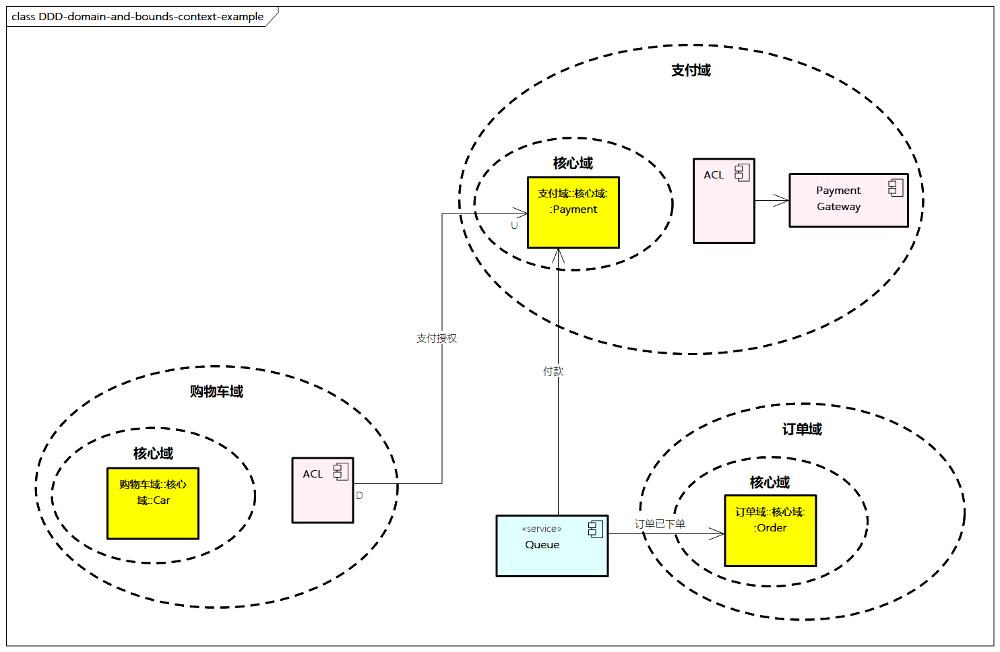

> 图例：DDD领域与界限上下文示例

购物车进行在线的支付授权，订单处理下单过程，并触发支付域的付款结算。

这里我们简化整个建模的过程，假设已经抽象出购物车域、支付域、订单域（通常购物车域也可以被包含在订单域内），核心的`Cart`、`Payment`、`Order`。

**领域之间通过限界上下文进行交互**，因为购物车域和支付域密切相关，需要等待支付授权，我们通过`ACL`进行关联；而订单下单和付款动作相对解耦，通过领域事件在订单已下单后，触发支付域的付款动作。

## DDD的核心概念

DDD在构建领域模型的过程中，涉及比较多的概念。这里着重解读一下以下几个。

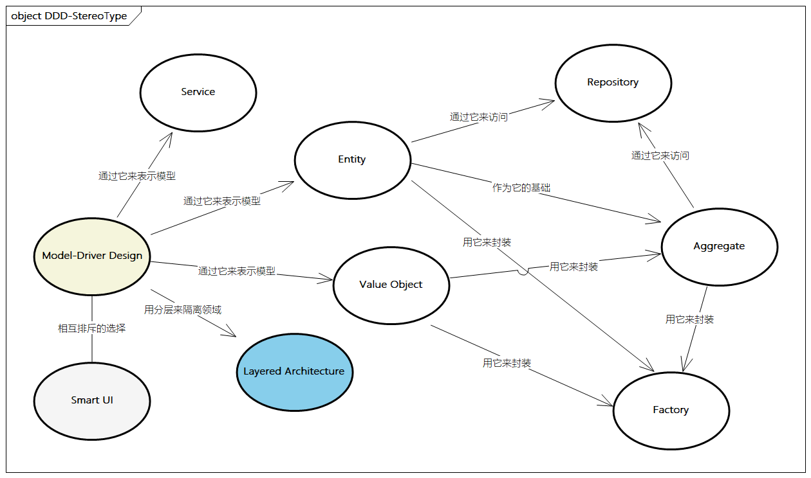

> 图例：DDD的核心概念

### 实体（Entity）

**实体是一个具有唯一身份标识的对象，并且可以在相当长的一段时间内持续变化**。

我们可以对实体进行多次修改，一个实体对象可能和它先前的对象大不相同，但**拥有相同的身份标识，即依然是同一个实体**。

对实体而言，**重要的不是其属性，而是其延续性和身份标识**。一般实体的唯一标识有两种生成方式。

1. 应用可以**自动为实体生成唯一标识**，比如JDK自带的UUID、数据库的自增序列
2. 有时也需要**综合业务语义来考虑**，比如通过业务属性、时间、IP等因素生成

另外，**实体具有可变性**，这里需要引出两个概念：

- **贫血模型**：贫血模型与Bean或者DO对象类似，一般只有Getter和Setter方法，只作为保存状态或者传递状态，不包含业务逻辑，**这种只有数据没有行为的对象不是真正的领域对象**
- **充血模型**：**DDD中的实体属于充血模型**，会封装包含这个实体相关的所有业务逻辑，它既是多个业务属性的载体，又是操作或行为的载体。

> 以订单（Order）为例，**Order有下单、发货和退单等行为**，***而面向数据设计方式是将这些行为放到另一个服务OrderService中，而不是Order对象中***。

### 值对象（Value Object）

**值对象是只关心属性的对象，并且是一个没有标识符的对象**。

**值对象本质上是一个集合，这个集合中包含若干用于描述目的、具有整体概念和不可修改的属性**。它可以避免属性零碎，使属性归类更加清晰，从概念理解上也更加完整。

值对象在领域模型中是**可以被共享的，它们应该是不可变的**，当有其他地方需要用到值对象时，可以将它的副本作为参数传递。

值对象与实体的区别在于：

- **值对象一般依附于实体而存在，是实体属性的一部分**。
- 值对象**没有唯一标识**，当任何属性发生变化时，都意味着新的值对象产生。
- 值对象**功能单一**，一般是贫血模型。

> 以Order为例，订单下的送货地址（Address）就是典型的值对象。**Address并不随着Order的产生而产生，它相对不变，也不需要单独标识**。

### 领域服务（Domain Service）

领域中的一些概念不太适合建模为对象，它们**本质上是一些操作、一些动作，代表领域中一个重要的行为**。这些操作或动作往往**涉及多个领域对象**，并且需要协调这些领域对象**共同完成这个操作或动作**，这就是领域服务。

领域服务有一个**重要的功能就是可以避免领域逻辑泄露到应用层**。如果没有领域服务，那么应用层会直接调用领域对象完成本该领域服务执行的操作。

**领域服务体现的行为一定是不属于任何实体和值对象的，但它属于领域模型的范畴，同时领域服务应该是无状态的，应确保领域服务和通用语言是一致的**。

- 领域服务是**无状态**的
- 领域对象是**有状态**的

虽然服务本身也是对象，但它**没有属性，只有行为**，因此说它是无状态的。

> 以订单发货（OrderDelivery）为例，需要Order和履约**两种实体之间通过一定的业务逻辑，确保事务可以作为领域服务**。

### 聚合（Aggregate）

聚合的**核心思想是将关联减至最少，这样有助于简化对象之间的遍历，使用一个抽象来封装模型中的引用**。

聚合由两部分组成：

- 一部分称为根实体，是聚合中的特定实体。根实体是聚合中所包含的一个特定实体，是唯一允许外部对象保持对它的引用的元素。
- 另一部分描述一个边界，定义聚合内部有什么。边界内部的对象之间可以互相引用。

除根实体外的其他对象都有本地标识，但这些标识**只有在聚合内部才需要加以区分，因为外部对象除根实体外看不到其他对象**。

**聚合行为被视为一个整体，在每个行为完成时，必须满足聚合内部所应用的固定规则的要求，即保证数据变化的一致性**。

根实体最终检查固定规则，如***删除操作必须一次删除聚合边界之内的所有对象***。

> 过程中有一些最佳实践，比如**可以设计一些小的聚合**，通过唯一标识引用其他聚合，并且在边界之外考虑最终的一致性。
>
> 比如，订单域可能有很多实体，如Order、子订单、订单明细、地址、物流信息、支付信息等，而在我们将它们聚合为订单域后，这些实体都聚焦在一起，并**由Order这个实体作为聚合根对外交互**。

### 工厂（Factory）

当创建一个对象或创建整个聚合时，如果创建工作很复杂，或者暴露了过多的内部结构，则可以使用工厂来进行封装。也就是说，**将创建复杂对象的实例和聚合的职责转移到一个单独的对象，这个对象本身在领域模型中可能没有职责，但它也是领域设计中的一部分**。

> 设计模式中的工厂类和工厂方法与领域模型中的工厂概念是相似的，其可以帮助我们封装复杂的对象创建过程。

我们可以**把工厂作为一种创建复杂对象和聚合的实现方式**。工厂用来**封装对象创建所必需的知识**，它们对创建聚合很有帮助。当聚合的根建立时，所有聚合包含的对象将随之建立。

### 资源库（Repository）

在DDD中，资源库作为对象的提供方，能够**实现对象的持久化，解耦领域内业务逻辑与底层持久化**。

每个聚合类型可以对应一个资源库，过程中需要避免实体和值对象成为单纯的充血模型，我们需要资源库把ORM框架与领域模型隔离，以屏蔽数据访问的技术复杂度。资源库可以获取持久化对象，使应用程序和领域设计与持久化技术解耦，让我们始终聚焦于模型，并且将所有对象的存储和访问操作交给资源库来完成。在面向接口和依赖注入机制支持下，资源库也容易通过Mock等方式进行测试。

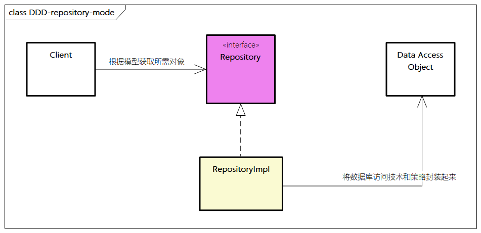

> 图例：DDD中资源库模式

工厂和资源库之间存在一定的关系，它们都能**帮助我们管理领域对象的生命周期**。然而，**工厂关注的是对象的创建**，而**资源库关心的是已经存在的对象**。

当一个新对象被添加到资源库时，它应该是先由工厂创建过的，再被传递到资源库，以便更好地保存它。

另外，资源库和数据访问对象（`Data Access Object`，`DAO`）的作用类似，但也有所不同，**资源库以“领域”为中心，所描述的是“领域语言”，不涉及数据库实现的细节**；而DAO是比资源库**更低的一层，其包含如何从数据库中提取数据的代码**。

### 领域事件（Domain Event）

**领域事件表示领域中所发生的重要事件，在事件发生后通常会导致进一步的业务操作，或者在系统其他地方引起反应**。

领域事件非常重要，我们在系统设计过程中经常需要解耦，技术人员一般通过MQ方式进行；架构人员可能采用[事件驱动架构（`Event Driven Architecture`，`EDA`）](patterns.md#事件驱动架构)的方式。`Serverless`架构中核心的就是基于事件编程，这一切的**核心就是对领域事件的设计**，不过当前大部分系统事件（`Event`）设计比较随性，从而导致`Event`滥用和无用情况发生，而领域事件是对我们很好的指引。

> 比如，在订单的例子中，在订单下单后，会进行***库存冻结、支付状态更新、物流同步***等，这些都是对系统事件良好的解耦设计。

- **Event命名**：`Domain Name` + 动词的过去式 + `Event`，如`OrderCreatedEvent`。
- **Event内容**：`Enrichment`（`Payload`中放`Data`），`Query-Back`（通过回调拿到更多的`Data`）。
- **Event管理**：通过`MQ`等保存所有的`Events`，并提供良好的`Event`查询和回溯。
- **Event处理**：事件构建和发布、事件数据持久化、事件总线、消息中间件、事件接收和处理等。

### 小结

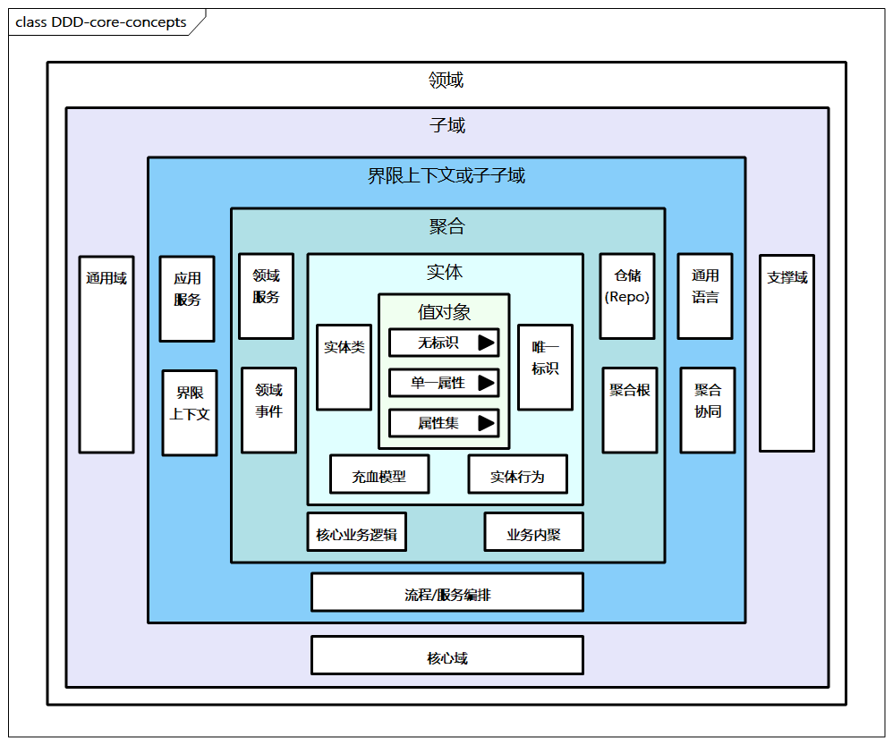

> 图例：DDD核心概念

## DDD常用的分析方法

DDD常用的分析方法主要有**用例分析法**、**四色建模法**和**事件风暴法**。

### 用例分析法

用例分析是比较通用的领域建模方法，可以在***比较传统的需求调研过程中结合领域模型的设计思路***进行，核心是**通过业务需求、场景流程等梳理用例，进而规划领域模型**。

用例分析的**前提是业务架构的需求输入，其中核心是业务能力与业务流程**。

> 比如电商领域的订单寻源、库存锁定、商品价格计算、优惠券核销等业务能力，以及订单处理、分单和拆单、逆向退款等业务流程。

**每个用例应该面向一个或多个场景**，场景主要说明应用是如何和最终用户互动的，也就是谁可以使用应用做什么，从而**获得一个明确的业务目标**。

编写用例时要避免使用技术术语，应该使用最终用户或者领域专家可以理解的语言，进而我们可以基于用例分析法，根据语义来整理用例，然后整理领域模型，大概步骤如下。

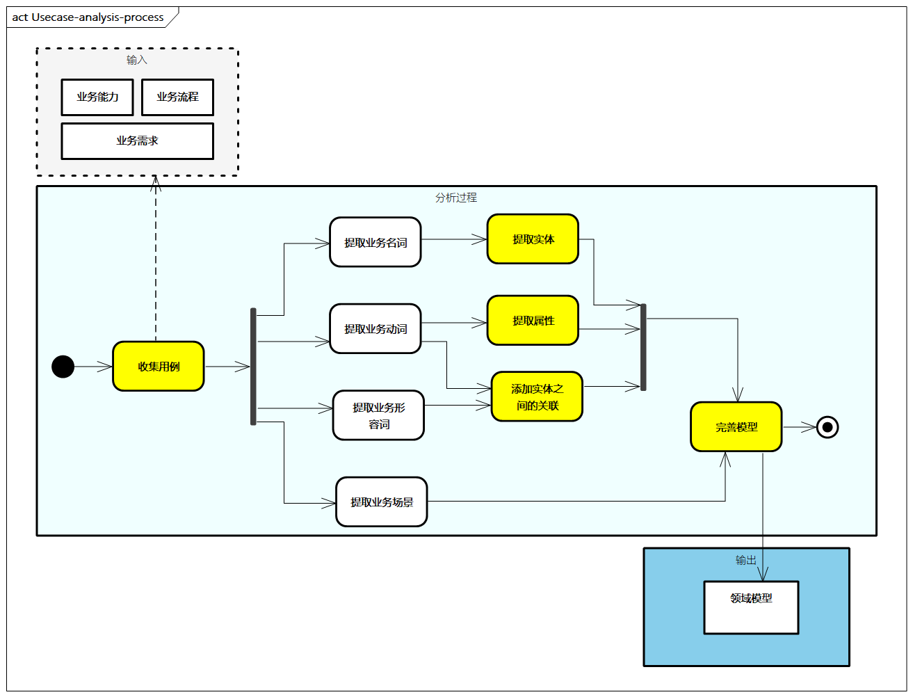

> 图例：用例分析法过程

- **收集用例**：从业务能力、业务流程、业务需求描述中进行提取，收集相应的名词、动词、形容词，以及对应的业务场景。
- **提取实体**：从名词中定位出主要实体，如商品、SKU、品类等。
- **提取属性**：从形容词中添加实体属性，如颜色、价格等。
- **添加关联**：从动词或形容词中添加实体和实体之间的关联，如商品“包含”SKU，卖家“开设”“多家”店铺等。
- **完善模型**：识别出初步模型，验证并迭代模型，同时补充用例验证模型、业务流程验证模型。

> 举个关于电商的例子:
>
> 假设有这样的需求描述：“会员使用代金券兑换了很多促销的商品。”
>
> 我们先从**名词“会员”“代金券”“商品”中提取实体**，并**从形容词“促销的”提取商品的属性**，进而**将动词“使用”“兑换”识别成关联**，同时结合行业知识得知，代金券属于优惠券的一种，最终得出领域模型。

> 图例：用例分析模型示例

### 四色建模法

四色建模法在实践中也比较常用，其包括以下几个核心概念。

- **时间记录（Moment-Interval）**：具有**可追溯性**的记录运营或管理数据的时刻或时段对象（如**用粉红色表示**）。
- **人货场（Party-Place-Thing Archetype，PPT）**：代表参与到流程中的参与方、地点、物（如**用绿色表示**）。
- **角色（Role）**：在时间记录与PPT对象（通常是参与方）之间参与的角色（如**用黄色表示**）。
- **描述（Description）**：对PPT对象的一种补充描述（如**用蓝色表示**）。

简单地说，四色建模法关注的是，**某个人（`Party`）的角色（`PartyRole`）在某个地点（`Place`）的角色（`PlaceRole`）用某个东西（`Thing`）的角色（`ThingRole`）做了某件事情（`Moment-Interval`）**。

> 下面以一个课程报名缴费的例子对四色建模法进行说明。
>
> 报名人可以为学生进行报名，产生对应的报名登记记录和课程表，进而缴费人进行缴费，产生缴费记录。
>
> 在这个过程中，“人”有学生和课程，对应的“角色”是报名人和缴费人，完成的“时间记录”是报名登记记录、课程表及缴费记录，再加上一些补充描述。

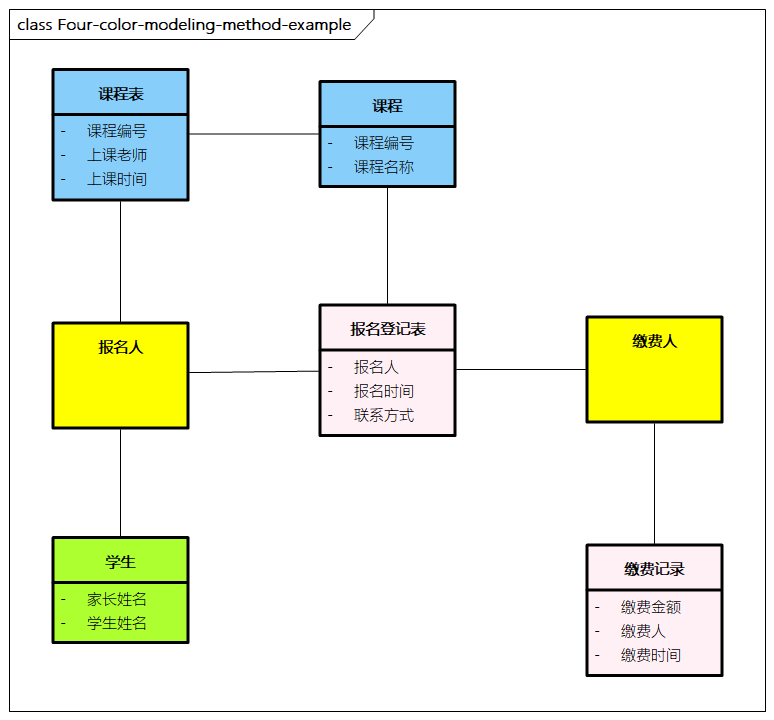

> 图例：四色建模法示例

### 事件风暴法

**事件风暴又称事件建模，与头脑风暴类似，可以快速分析复杂的业务领域，完成领域建模的目标**。

事件风暴是事件驱动设计的典型代表，是一种快速、轻量且未得到充分认可的群体建模技术，它**对于加速开发团队非常适用**。

事件风暴法关注以下元素。

- **事件**：发生了什么事情，产生了什么结果（如**用橘黄色表示**）。
- **属性**：事件的输入、输出，是对时间的细化描述。
- **命令**：某个动作的发起者，可能是人、外部事件、定时器等（如**用蓝色表示**）。
- **领域**：领域的聚合、内聚、低耦合，聚合内部保证数据的一致性（如**用黄色表示**）。

简单理解就是**谁在何时基于什么（输入）做了什么（命令），产生了什么（输出），影响了什么（事件），最后聚合成了什么（领域）**。

事件风暴催化并加速整个建模过程，强调**正确的人**（业务人员、领域专家、技术人员、架构师、测试人员等关键角色都要参与其中）、**开放空间**（有足够的空间可以将事件流可视化，让人们可以交互讨论）、**即时贴**（至少三种颜色），关联的人**充分讨论，集体决策，从价值角度来审视业务流程的合理性**。领域事件容易**促使业务人员和非业务人员达成共识**。

下面通过一个电商的例子说明事件风暴的主要过程。

1. 首先，我们**基于业务流程和业务流程的输入**，对事件进行头脑风暴，**主要识别应用层面的主要状态结果**。比如识别出“商品已创建”，“库存已扣减”，“订单已支付”等。
2. 其次，我们来**识别命令，即什么人做什么事**，可以识别出运营人员可以添加商品和编辑库存，用户可以创建订单，并伴随着对应的事件
3. 再次，我们来**进行聚合，即将相关的实体聚合在一起**，可以看到商品、库存、订单三个领域初步识别，并与相关的命令和事件结合在一起
4. 最后，我们对这些领域进行边界划分，**识别出对应的限界上下文**。

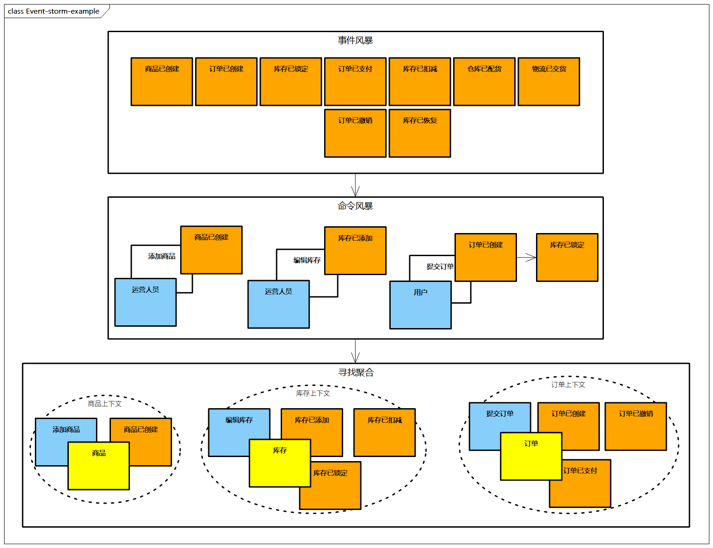

> 图例：事件风暴示例

## DDD分层架构

DDD在具体落地实施的过程中，强调四层分层结构，将核心概念进行有效的整合，各层的职能定义如下。

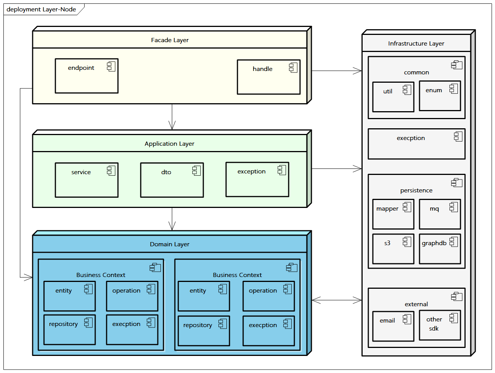

> 图例：DDD分层架构

- **展示层（Facade Layer）**：负责与不同用户和应用之间的交互协议和数据格式的转换，因此它又叫用户接口层。
- **应用层（Application Layer）**：应用层是很薄的一层，**负责展示层与领域层之间的协调，它是与其他系统的应用层进行交互的必要渠道**，负责对领域层组件进行简单封装，例如事务、调用应用程序的任务。应用层要尽量简单，其服务及方法一般以用例为对应关系，通常一个用例对应到一个应用层的服务方法，方法中不包含业务规则或者知识，不保留业务对象的状态，只保留应用任务的进度状态，更注重业务能力或者业务流程的相关展示。主要通过调用领域层和基础设施层来完成协调。
- **领域层（Domain Layer）**：领域层是DDD的核心，包含一些核心概念，如领域实体、值对象、领域服务、聚合，以及它们之间的关系。它主要负责表达业务概念、业务状态信息及业务规则，具体表现形式是领域模型。DDD提倡充血模型，即尽量将业务逻辑归属到领域对象上。
- **基础设施层（Infrastructure Layer）**：基础设施层向其他层提供通用的技术能力，为应用层传递消息（如API网关等），为领域层提供持久化机制（如数据库资源、中间件交互等），屏蔽技术底座能力（如底层服务的健康度检查、配置参数等）及其他通用的工具类服务。

除了比较经典的四层分层架构，DDD还有一种松散分层架构，即端口适配器架构。

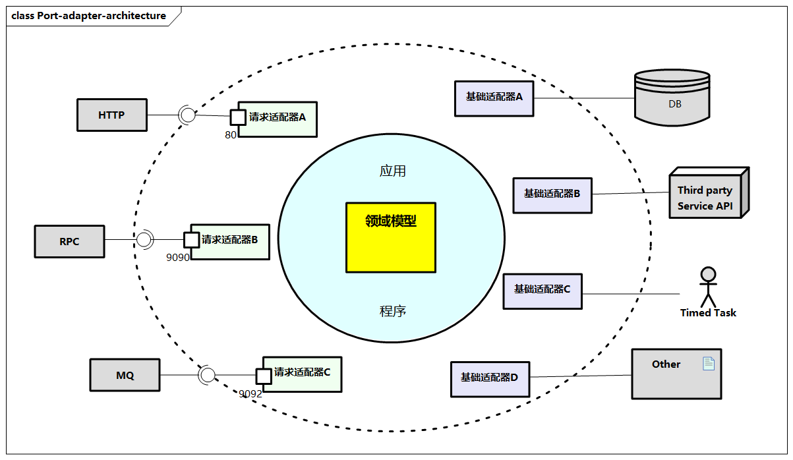

> 图例：端口适配器架构

端口适配器架构通过划分内部和外部，系统由内而外围绕领域模型展开。领域部分位于最内层，应用程序包含领域模型和业务逻辑，对于外部而言，通过各种适配器进行上下文集成，包括数据持久化、第三方数据集成，同时基于依赖注入和Mock机制，适配器完成便捷的替换和模拟。

不论哪种分层架构，都遵循以下几个通用的DDD分层原则。

- **无环依赖原则**：组件的依赖关系中没有环路，如果出现，则需要打破循环依赖。
- **稳定依赖原则**：被依赖者应该比依赖者更稳定，同时组件的抽象程度应该与其稳定程度保持一致。一个稳定的组件应该是抽象的，这样便于扩展。
- **依赖倒置原则**：高层次的模块不应该依赖低层次的模块，它们都应该依赖抽象。抽象不应该依赖具体，具体应该依赖抽象。

## DDD与周边概念的关系

下面我们来看看DDD与一些周边概念的关系。

### DDD与数据驱动设计的关系

DDD给我们带来的是设计模式的改变。DDD的设计模式与传统的面向数据驱动的开发模式有明显的区别。

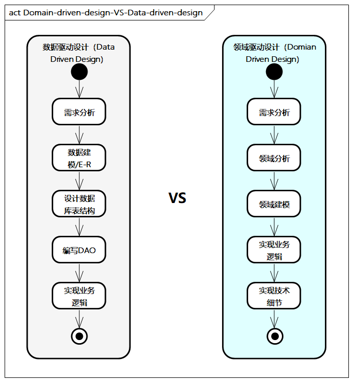

- **数据驱动设计从数据出发**，先梳理E-R图（实体-联系图），设计数据库表结构，编写DAO，然后实现业务逻辑。**数据驱动设计主要采用贫血模型，业务逻辑散落在大量的方法中，当系统越来越复杂时，开发时间将成倍增长，维护成本很高**。
- **DDD从领域出发**，分析领域内模型及它们之间的关系，并进行领域建模，设计核心业务逻辑，进而实现技术细节。**通过DDD，定义领域模型，从而确定业务和应用的边界，保证业务与代码的一致性**。

在DDD中，领域模型和数据模型是解耦的，有时也不是一一对应的，因此**在应用DDD进行设计时，一定要摆脱数据模型优先的束缚，不要让领域模型被数据模型“绑架”，设计出合理的领域模型是首要任务**。

### DDD与微服务的关系

**微服务是技术层面的分布式技术架构模式，是技术实现和部署的范畴**，它提倡将应用划分成更细粒度的服务，服务之间互相协调、互相配合，为用户提供最终价值。

DDD根据限界上下文设计出的领域模型和领域服务，通过微服务进行落地，并结合微服务及其他分布式技术（如DevOps、CI/CD、秒杀、全链路压测等），加速系统的落地。**一个域服务可由一个微服务来实现，也可根据DDD领域分析拆分为多个微服务，对外集合成统一的域服务**。

### DDD与企业架构的关系

DDD在企业架构中扮演着重要的角色。**DDD不仅是应用架构中领域建模重要的设计方法，同时在企业架构中承接业务架构，并对技术架构及具体落地时微服务等技术实现都有着重要的指导作用**。更重要的是，**DDD建立了共同语言，让企业的业务人员和技术人员可以高效地沟通**。同时，有些企业强调共享能力中心的设计和沉淀，**DDD可以作为其模型和服务建设方法**，结合其他架构服务设计模式及相关的最佳实践，助力企业的架构设计与规划。

### DDD与开发实施的关系

DDD带来了很多好处，本质上是**设计模式的改变，让领域与数据解耦，从业务需求出发，从领域出发，分析领域内模型及它们之间的关系，并进行领域建模，设计核心业务逻辑，进而实现技术细节**。DDD起到了承前启后的关键作用，其不仅**将业务人员和技术人员连接起来**，还把系统从需求、设计、开发、部署、运维整个生命周期环节有效地串接起来，DDD更多地**从总体和顶层设计，从问题域、解决方案域、业务模型角度，不深度干预其他环节细节，边界清晰，关注点分离**。

## 扩展阅读

- [使用域分析为微服务建模 - Microsoft](https://learn.microsoft.com/zh-cn/azure/architecture/microservices/model/domain-analysis)
- [使用战术 DDD 设计微服务 - Microsoft](https://learn.microsoft.com/zh-cn/azure/architecture/microservices/model/tactical-ddd)
