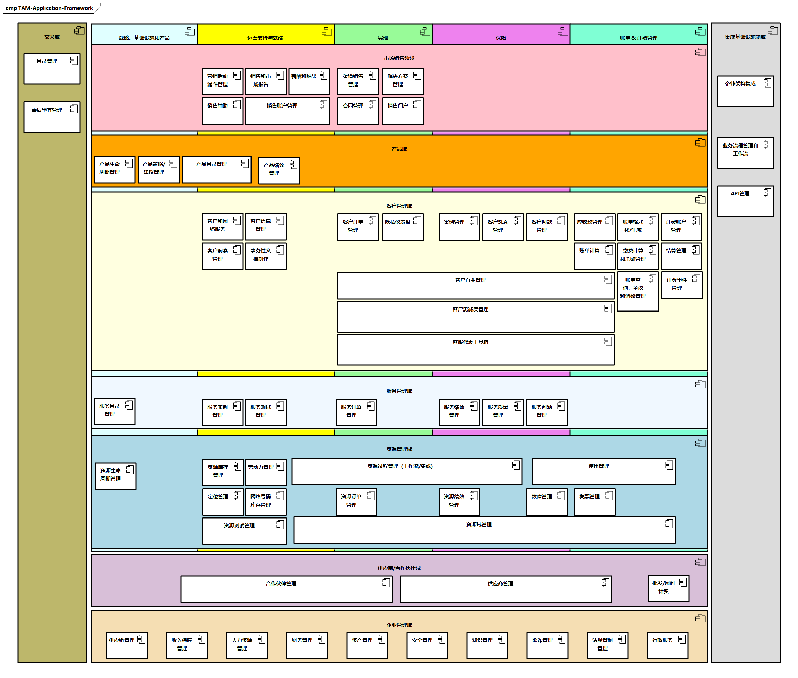
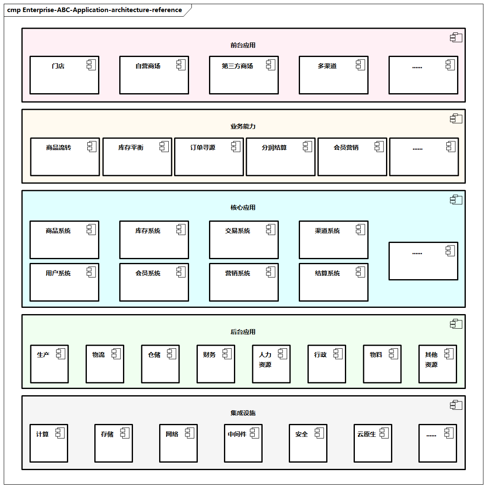
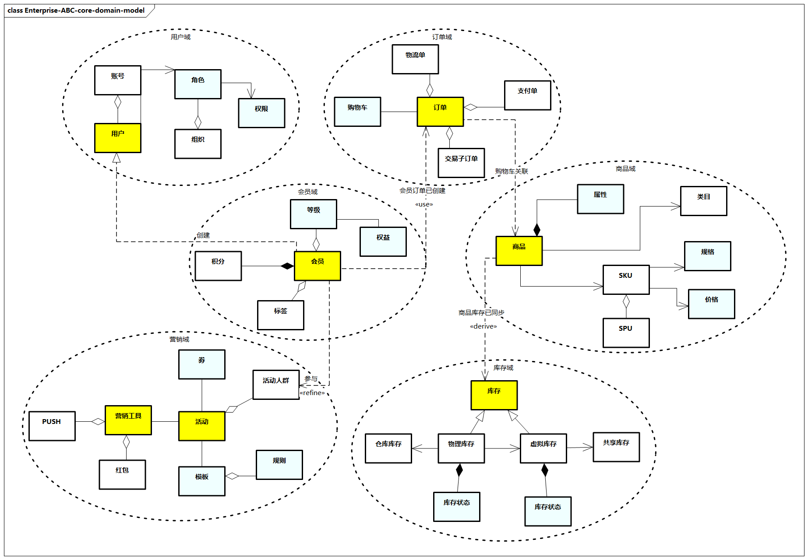
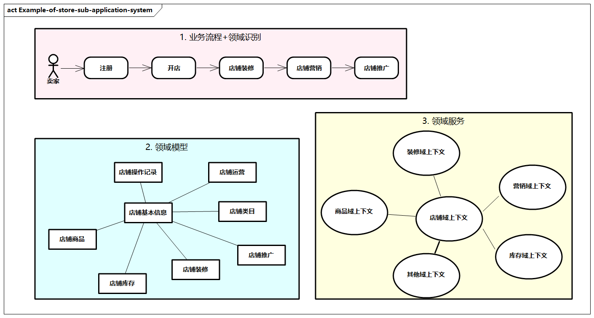

# 应用架构参考设计

## TAM应用架构参考

TM Forum理论提供了一个关于[The Application Framework（TAM）的企业应用架构的参考](http://www.ilsa.kz/etom/main/diagram212bd3bc1d9811db9063000802da1ce2.htm)。

> TAM是TM Forum中开放数字化架构框架的一部分，为企业应用架构框架提供了一个通用的方法。

TAM涵盖产品、运营、服务、保障等纵向业务，以及市场销售域、产品管理域、客户管理域、服务管理域、资源管理域、供应商/合作伙伴域、企业管理域等多领域需要的应用功能参考，这些多维的应用功能地图为定义和复杂的应用系统提供了一个范例。

TAM这个模型既没有根据DDD给出分析的过程，也没有给出具体的领域模型和服务，但从整体上给出了一个企业在不同域中需要考虑的核心应用功能，有比较高的参考价值。

> 图例：TAM应用架构参考

## 企业ABC应用架构参考

新零售应用需要的功能和服务多样，接着业务架构章节提到的[鞋服企业ABC案例](../biz-arch/reference.md)，我们来看看应用架构如何进一步结合业务架构落地。在业务架构部分，[一些业务能力](../biz-arch/reference.md#分析业务能力)，如商品流转能力、库存平衡能力、订单寻源能力、分润结算能力、会员营销能力等，同时伴随着[很细致的业务流程](../biz-arch/reference.md#梳理业务流程)。应用架构为了承载这些业务能力和业务需求，需要进行应用与服务的构建。大体把应用分为四层（其中业务能力承载自业务架构，这里先不包含进来）。

- **前台应用**：面向不同的用户的前端触点应用，这些应用**直接面向最终用户，是业务能力和业务流程的入口**。比如，面向线下门店店员的POS系统，面向线上营销人员的自营电商、第三方电商，以及多种多媒体营销渠道（如微信、微博、抖音），或者一些直播、微分销平台等。
- **核心应用**：**支撑业务的核心能力，形成企业的共享复用能力，支撑业务能力和业务流程的沉淀，通过核心的领域服务进行承载**，可能涉及企业的多个方面，如商品系统、渠道系统、库存系统、交易系统、用户系统、会员系统、营销系统、结算系统等。
- **后台应用**：企业**内部的稳态的管理系统，更多需要和核心应用及前端进行对接，提供企业内部管理的方方面面**，如生产管理、物流管理、仓储管理、财务管理、人力资源管理、行政管理、物料生产管理、其他资源管理等。
- **基础设施**：**支持这些系统的基础设施**，如计算设施、存储设施、网络、中间件、安全设施、云原生等。

> 图例：企业ABC应用架构参考

### 企业ABC的核心领域模型

企业ABC在具体的核心应用系统设计中，进一步可以聚焦相关的主要能力、领域模型及领域服务，建模过程可以参考[DDD](./domain-driven-design.md)及[相关的应用架构设计方法](./design-methods.md)，进而可以得到领域模型。

整个设计过程的内容比较多，这里只做简要说明，这里仅展示几个核心的领域，比如用户域、会员域、营销域、订单域、商品域、库存域，里面的实体、值对象、领域服务及领域事件等仅展示部分内容。

企业ABC对不同的核心领域进行应用系统建设，为了方便开发和管理，每个领域对应一个应用系统，这里简单总结一下这些应用系统的主要能力、核心模型（包括聚合、实体、值对象等）和核心服务（包括领域服务、领域事件等）。

> 图例：企业ABC的核心领域模型

### 商品系统

- **主要能力**：建立和维护统一的商品库，并提供商品的管理和运营能力，为上层业务提供简单、统一的商品与服务。
- **核心模型**：商品、类目、品牌、价格、属性、产品SPU、SKU、商品详情等。
- **核心服务**：基础数据管理，包括品类管理、产品SPU管理、SKU管理、属性管理等；品牌类目管理，包括商品品牌的维护与查询，商品类目的维护与管理；商品发布管理，包括商品上架和下架管理、商品发布与编辑等；价格管理，包括销售价、批发价、零售价，以及价格生效/失效时间；商品组合管理，包括组合SKU、临时组合等；评价管理，包括商品评价、回复管理等；产品管理，包括对产品模板的创建、编辑、查询、禁用等。

### 渠道系统

- **主要能力**：建立和维护统一的上游和下游组织网络渠道，并提供地区、门店、店铺、供应商、经销商等管理和运营能力，为上层业务提供简单、统一的渠道与服务。
- **核心模型**：门店、店铺、供应商、经销商、类目、地区等。
- **核心服务**：渠道数据管理，包括对渠道的创建、编辑、查询、停用等；渠道关系管理，包括渠道与仓库的关系、渠道与组织的关系、供应商与组织的关系等；店铺管理，包括商户管理、店铺会员管理、店铺装修、店铺开通等；其他服务，如门店管理、供应商管理、经销商管理等。

### 库存系统

- **主要能力**：对仓库统一管理，管理所有的物理仓、门店仓、电商仓，提供统一库存管理模型和算法，支持多渠道库存实时共享，基于虚拟库存模型实现库存共享和自动调配。
- **核心模型**：实体库存、逻辑库存、共享库存、渠道库存、出入库单据、出入库单据明细、出入库通知等。
- **核心服务**：库存管理，包括库存寻源、库存占用、库存共享、自动调配等；库存状态管理，包括可用、在途、占用、共享等；仓库管理，包括逻辑仓、实体仓、渠道仓的管理；货品管理，包括货品出入库、调拨、盘点等；库存同步，包括渠道仓库、逻辑仓库、实体仓库之间的同步。

### 交易系统

- **主要能力**：交易系统也可以叫订单系统，新零售应用主要围绕订单来进行，负责企业业务交易订单的整个生命周期管理，包括订单生成、合并拆分、流转、发货、退换货等，涉及企业多种业务模式，如线下门店自提、线上销售、O2O等，特别是通过订单的不同交易节点进行流程编排和配置化等。
- **核心模型**：主订单、子订单、订单状态、订单明细、订单日志、退货单、换货单、物流单。
- **核心服务**：购物车管理，包括购物车商品添加、编辑、查询等；正向交易管理，包括交易订单生成、订单转换、发货通知等；逆向交易管理，包括商品换货、退货、退款等；订单数据管理，包括交易订单记录等；订单管理，包括订单拆分合并、订单寻源等；订单状态管理，包括已加购、待付款、待发货、已收货、售后中、退货中、退款中等。

### 用户系统

- **主要能力**：存储和维护统一的用户和组织库，并提供人员信息、组织机构、用户信息的管理和运营能力，为上层业务提供统一的用户与服务。
- **核心模型**：用户、员工、组织、角色、权限、账号等。
- **核心服务**：组织管理，包括对组织级别、组织属性及属性组管理；人员管理，包括人员添加、查询、角色权限配置等；账号管理，包括系统账号、密码管理等。

### 会员系统

- **主要能力**：统一会员生命周期管理，促进用户购物、提高用户黏性，提高AIPL转化，关注拉新转化、复购、客单价等。支持多个品牌会员体系，以及会员权益发放与兑换，会员积分、等级权益的服务，通过会员系统收集和分析会员的消费行为和画像；支持多种业务场景，如社交营销、消费即会员、无感积分等。
- **核心模型**：会员、等级、权益、积分、成长值、画像、付费会员、会员标签等。
- **核心服务**：会员运营管理，包括会员注册、个人信息维护、会员卡办理等；会员体系管理，包括会员体系的创建、积分规则、成长值规则、等级、权益等；会员积分管理，包括积分获取、核销、清零、兑换等；基础信息服务，包括成长等级、审核认证、行为触点服务、积分活动等。

### 营销系统

- **主要能力**：提供营销体系，如活动支持满减、满赠、满折、特价、抽奖、红包等，支持营销活动规则的制定和发布，支持多渠道优惠券、折扣券的管理、发券及核销。
- **核心模型**：活动模板、营销活动、活动规则、营销工具、优惠券等。
- **核心服务**：活动模板管理，包括营销活动的策略类型、策略模板、规则配置、动作模板等；活动管理，包括基本信息、店铺圈选、商品管理、活动频次、触发条件，活动发布等；优惠券管理，包括优惠券的发放、领取、查询、使用、核销等。

### 结算系统

- **主要能力**：提供企业核心财务结算管理，提供业务规则、结算规则、业务结算、财务对账等服务能力。
- **核心模型**：资金账户、支付渠道、结算类型、结算主体、结算单、支付网关等。
- **核心服务**：结算主体管理，包括经销商主体、企业多主体管理等；结算规则管理，包括结算来源、转换规则、支付方式等；资金账户管理，包括经销商资金账户、信贷维护和审批等；财务结算管理，包括采购结算、经销商结算、商场结算、O2O结算、跨企业主体结算、财务对账、结算风险管理等。

上面提到的众多系统都可以通过[应用架构设计方法](design-methods.md)来进行设计，这里我们以渠道系统中的一个子系统——店铺系统为例，进一步看看通过领域建模方法构建应用架构中核心的领域模型和领域服务的过程。

> 图例：店铺子应用系统示例

首先，我们做准备工作，从业务架构的业务流程和业务能力出发。店铺系统是电商平台的一部分，主要面向买家、卖家及平台运营者。这里对卖家进行分析，可以看到主要涉及注册、开店、店铺装修、店铺营销及店铺推广，同时我们从业务能力中识别了一些关键的业务活动，如注册时提交资质审核资料，开店时创建店铺等。其次，我们初步分析出一些领域，包括店铺域、商品域、库存域、营销域等。再次，我们进行领域模型的设计，结合DDD等方法，可以得出店铺基本信息、店铺类目、店铺库存、店铺商品、店铺装修、店铺运营等基本领域实体，并且建立它们之间及它们与其他领域模型的关系。最后，我们根据DDD的上下文，对店铺域和其他域（如商品域、装修域、营销域）进行上下文分析，并建立各自的领域服务及彼此之间的交互关系。在完成店铺应用系统的核心设计后，我们可以按照这个思路来构建其他应用，并逐步构建整体的企业应用架构。
