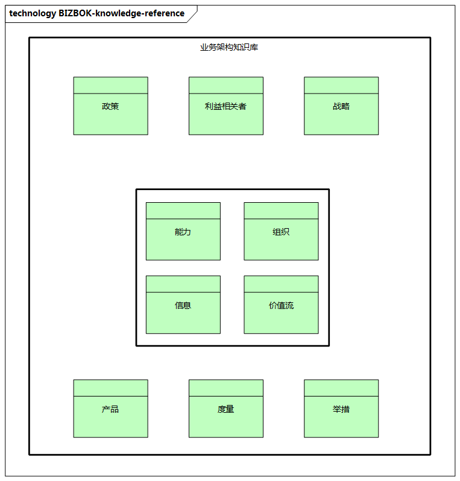
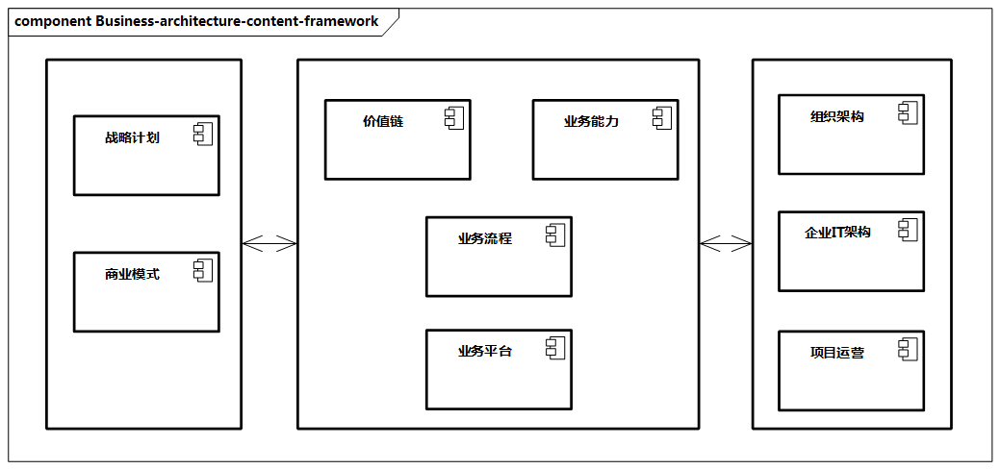

# 业务架构设计

业务架构是企业架构的基础，它在整个企业架构中扮演着至关重要的角色。

**业务架构是明确从企业战略计划到企业各部分如何运转的工具，其从企业的全局视角，对后续企业架构及业务运营方向提供指导**。

业务架构中主要描述企业的关键业务中涉及的内容：

- 企业结构和各部分交互关系
- 关注内外部协作关系
- 如何满足客户需求
- 进行市场竞争与合作伙伴合作
- 建立生态体系和运营模式
- ......

## 业务架构概述

业务架构（Business Architecture）来自业务，我们先来看看什么是“业务”。

- 在百度百科中，业务被定义为“**各行业中需要处理的事务，但通常偏向指与销售有关的事务，企业最终主要以销售产品、销售服务、销售技术等为主要盈利模式。**”
- 在`TOGAF`中，业务被定义为“**任何与产品和服务的售卖相关的组织行为**”。

可以看出，业务最终的目的是“售出产品，换取利润”，**业务是为企业产生盈利的工作和经营活动**，一般指面向客户销售商品。

业务架构是企业架构的基础，它是一个**企业蓝图**，提供一种**业务层面的共识**，是为**支撑企业业务的目标而定义的一套运作管理体系的结构化描述，描述各级组织日常业务运作、模块化和层次化的业务能力结构**，为应用架构、数据架构、技术架构提供指引。

**业务架构与企业战略计划直接相关，是企业战略计划转化为实际项目及日常运营的关键**。

**广义的业务架构与企业的业务板块和组织结构有密切的关系**。

- 涉及企业的核心业务板块，如技术研发、生产制造、采购供应、市场销售、客服服务等纵向业务
- 涉及支撑企业日常运营的运营部门和财务、人力、行政、仓储、IT等支撑部门的横向业务

业务架构可以明确企业人员、资金、信息化、服务等企业资源如何进行部署和分配。

> 图例：业务架构与业务版块

业务架构是基于企业战略计划确定企业各组织部分如何运转的机制，是从战略范畴到战术范畴的转化，是对企业战略计划和业务需求的高度总结。

比如：

- 需要开展什么业务？
- 产品和服务的市场定位是什么？
- 如何进行市场竞争？
- 需要具备什么样的资源、技术等？
- 如何与利益相关者达成一致的业务理解？

这种战略的转化需要**从企业的商业模式及业务价值链进行分析**。

> 现实中，很多企业对业务架构不够重视，要么没有体系化的业务架构，要么将业务架构作为IT的一小部分。
>
> 其实，业务架构在企业架构中承载着非常重要的作用，如果没有一个好的业务架构来准确表达企业的业务，则会对企业数字化转型效果产生很大影响。

## 业务架构的理论参考

业务架构是一个整体性、全局性的蓝图，涉及企业业务的方方面面。

在传统的企业架构分析中，业务架构可以从一些方面进行业务的梳理和架构设计，如:

- 企业的产能（如产能、批次）
- 设施（是集中还是分散）
- 技术（是采购软件还是自己研发）
- 平台（如资源成本分析平台）
- 人力（如员工的技能）
- 生产安排（如库存调度）
- 质量体系（如质量保障体系）
- 组织（如组织的“权责利”）
- ......

在经典的`TOGAF`框架中，业务架构主要包括以下四个部分。

- **战略目标**：可以采用综合平衡计分卡，将战略目标、KPI、绩效考核作为业务架构战略目标的载体。
- **业务组件建模**：是业务架构设计的起点，将一个企业所涉及的全部业务活动进行组合，是对企业中复杂的业务流程与海量数据的业务活动进行的简化。
- **业务流程**：是业务架构分析的核心，提供流程分类框架，分为战略层、运营层和支持层三大类，进而按照价值链、业务域、逻辑关系层与活动层进行逐步设计，是`TOGAF`架构的流程支撑与载体。
- **组织架构**：是企业的“骨骼”，是企业的运筹体系，是实现转型的组织保障。在业务架构设计中，除了要明确企业的部门、岗位、职责，还要明确组织与业务和职能之间的关系，建立对应的矩阵。

> 业界有一些关于业务架构的研究理论，其中BIZBOK是一种通用的业务架构方法，介绍了业务架构的知识体系，由The Open Group进行开发和维护，在国际上有不少企业应用，不过国内企业应用得还比较少。

> 图例： BIZBOK业务架构知识参考

业务架构基础，是业务架构的核心内容。

- **能力**（`Capabilities`）：企业做什么？
- **信息**（`Information`）：使用什么词汇？
- **组织**（`Organization`）：企业如何组织？
- **价值流**（`Value Streams`）：企业如何向关键利益相关者提供价值？

业务架构扩展信息，将为业务提供更大的洞察力。

- **战略**（`Strategies`）：企业应如何竞争和发展？
- **政策**（`Policies`）：什么决定了战略、投资和行动？
- **利益相关者**（`Stakeholders`）：谁是内部和外部参与者？
- **举措**（`Initiatives`）：如何实现目标和目的？
- **产品**（`Products`）：为客户提供什么？
- **度量**（`Metrics`）：业务表现如何？

## 业务架构的内容框架

不同的企业或理论对企业架构具体涉及的内容的设计或描述有所不同。但在企业架构的组成要素中，其中有几个非常高频，这里我们从整体企业架构的角度，聚焦较重要的几个组成部分展开分析。

> 图例：业务架构内容框架

业务架构承接战略计划，并为企业IT架构与项目运营提供指导，是企业战略计划转化为实际项目及日常运营的渠道，业务架构包括以下核心要素。

- **商业模式**：本质上是企业战略计划中对企业业务的商业模式的描述，回答企业用什么方式盈利，如何盈利，开展什么业务等。
- **价值链**：描述企业的业务价值链条，本质上是业务流程的顶层能力和流程的体现。
- **业务能力**：执行产生价值结果的活动的能力体现，过程中可能包括组件化的分析，对企业的业务进行全面、直观的反映。
- **业务流程**：由一系列业务活动经过一定的逻辑方式组合起来，以实现某种业务目标的过程。
- **组织架构**：与业务架构密切相关，包括业务划分、相关的职责和权利，也涉及绩效考核。

我们再通过"业务架构各个元素之间的关系图"看看这些概念之间的关系。

- **从战略角度主要回答Why**，客户需要什么，企业通过商业模式回答要做什么，战略计划是什么，并伴随着组织结构的设定。
- **业务架构主要回答What的问题**，通过对战略计划的分解，产生价值链，并进而分析出业务能力及业务流程，业务能力关注结果，业务流程关注过程，再结合核心的业务活动，进而产出业务架构。从架构视角来看，业务架构是企业IT架构的输入，领域服务、领域模型、数据模型等都是企业IT架构的范畴，进而从方案视角设定企业产品和解决方案。
- **通过实施视角回答How的问题**，也就是通过项目落地实施，产出产品与服务的具体组合，进而交付给客户，同时经过治理运营进行持续的迭代优化。

> 图例：业务架构各元素之间的关系

## 业务架构的价值

业务架构可以带来以下好处。

1. 业务架构**以业务战略为导向**，对企业的**关键业务流程、组织架构进行整体规划**，明确彼此之间的关系，确保业务战略的实现。
2. 业务架构可以**帮助企业界定业务的范围和边界，并确定组织中的定位分布**，同时**从业务视角更好地规划系统，从全局和顶层加以考虑，总体协同**。
3. 业务架构**为企业IT架构提供指引**，是应用架构、数据架构、技术架构**重要的参考和输入**。
4. 业务架构通过**对业务的梳理，促进业务流程的优化**，同时促进新业务、新产品和解决方案的迭代。
5. 业务架构**帮助企业干系人对齐战略思路**，以客户为中心，向战术的落地项目转型，保证战略、运营、技术的衔接。
6. 业务架构**从组织层面通过顶层的业务视角，加强跨业务部门的对齐和沟通**，为后续项目落地实施、IT投入提供指引。
7. 业务架构加速企业培养懂业务的人才，通过**共同的业务语言、业务思维**，了解企业内外部的环境，使得这些人才懂产品、懂渠道、懂客户、懂策略、懂经营，为企业的长期发展提供强大生命力。

## 业务架构的关键要素

### 商业模式

> 管理大师德鲁克曾说过：“当今企业之间的竞争，不是产品之间的竞争，而是商业模式之间的竞争。”

商业模式本质上是企业战略层面需要考虑的，但由于其对业务架构有着至关重要的作用，我们在此进行分析。

**商业模式是企业生存的“窍门”，可以帮助企业将内外部各要素整合起来，形成一个完整、高效、具有独特核心竞争力的运行系统，从而满足客户需求、实现各利益相关方价值的最大化，最终使企业持续盈利。**

商业模式最核心的三个组成部分是创造价值、传递价值、获取价值，三者是密切相关的环节。

- **创造价值**：基于客户需求，提供价值方案。
- **传递价值**：通过资源配置和相关行动来传递价值。
- **获取价值**：通过一定的盈利模式来持续获取利润。

#### 商业模式举例

在互联网和数字化时代，企业尝试突破传统商业模式的束缚，将生产、营销、交易、物流、支付等合为一体，打破时空的限制，并结合移动互联网、大数据、人工智能、云计算等，从根本上改变人们的消费理念和生活方式。同时，新零售也在尝试转型，如线下实体转线上发展，线上电商寻求线下突破。这里我们来看几种典型的电商商业模式。

- `B2C（Business to Customer）`：企业与消费者之间，是电商最普遍的模式，指商业零售，商家直接面向消费者，在线上销售自己的产品和服务。典型的例子如天猫、京东等。
- `B2B（Business to Business）`：企业与企业之间，也就是供应方和采购方之间通过电商作为中间运营者达成产品和服务的交易，解决供应商上游到中游的问题。典型的例子如阿里巴巴等。
- `C2C（Customer to Customer）`：消费者与消费者之间，针对海量商品和类目，做更加个性化的定制，形式与B2C比较接近，更加注重商品品质和服务。典型的例子如淘宝、微店等。
- `C2M（Customer to Manufactory）`：消费者与工厂直接对接，定制化生产和消费。C2M去掉了消费者和制造商之间的品牌商、零售商，更加注重定制服务与增值服务。典型的例子如淘宝特价版、拼多多等。
- `O2O（Online to Offline）`：线上与线下的融合。比如，线上获取信息，引流到线下购买；在线下体验后，将消费者引流到线上下单。这是典型的新零售商业模式，如今很多传统企业在O2O上发力。

**商业模式没有确切的行业标准，因为各个企业的经营之道不同.**

> 就新零售来说，我们可以从多种角度拆分出不同的商业模式。比如:
>
> - 从**交易模式**角度，可以分为直营、分销、寄售等；
> - 从**履约链路**角度，可以分为实时购、次日达等；
> - **从库存的角度**，可以分为预售、共享等；从会员营销角度，可以分为优惠活动、付费会员等；
> - 从**用户体验**角度，可以分为直播、拼团、秒杀等。

#### 商业模式分析工具

对于商业模式的分析有很多方法，各个咨询公司（如普华永道、德勤、毕马威、IBM、麦肯锡等）都进行了商业模式分析。商业模式分析是极其专业和复杂的，这里简单介绍两种商业模式分析工具。

##### 魏朱六要素商业模式模型

魏朱六要素商业模式模型是比较典型的商业模式分析工具，其认为商业模式主要包括六个主要要素:

- **定位**：应该提供什么样的产品和服务来实现客户的价值。定位是企业战略选择的结果，是商业模式分析的起点。
- **业务系统**：达成定位所需要的业务环节，以及相关角色之间合作与交易的方式，业务系统是商业模式的载体。
- **关键资源能力**：使业务系统运转所需要的重要资源和能力。
- **盈利模式**：指企业如何赚取利润，涉及各价值链中利益相关者之间利益的分配方式。
- **现金流结构**：是企业经营过程中产生的现金收入和支出的链条，反映该商业模式的投资价值。
- **企业价值**：是企业的投资价值，是评判企业商业模式优劣的标准。

##### 商业模式画布

商业模式画布应用得非常广泛，最初是由亚历山大·奥斯特瓦德（`Alexander Osterwalder`）提出的，通过商业画布的九宫格，我们可以将企业商业模式可视化，全面分析企业的商业情况。

- **价值主张**：为客户提供什么产品、服务及价值，以及帮助客户解决什么问题？价值主张是企业区别于竞争对手的地方，通过各种元素提供价值，如新颖、性能、定制、把事情做好、设计、品牌、价格、成本、风险低、可达性和可用性等。
- **客户关系**：与客户建立什么样的关系？客户关系包括个人协助、专属服务、自助服务、自动化服务、社区、共同创造等。
- **客户细分**：目标客户群体是谁？根据客户的不同需求和属性，对客户群体进行细分，以满足所选择的客户群体的需求。客户细分群体存在不同的类型，如大众市场、利基市场（特殊需求的小众市场）、区隔化市场、多元市场等。
- **核心资源**：拥有什么核心资源可以保障商业行为的执行？比如，实体资产、知识资产、人力资产、金融资产等。
- **关键活动**：需要做哪些事情才能使得产品和服务能够正常运行？比如，制造产品、解决问题、构建平台和相关的服务网络。
- **渠道通路**：通过什么方式将产品和服务触达客户，使得客户可以为之买单？渠道通路的思考分为五个阶段，包括认知、评估、购买、传递、售后。渠道可以分为自有渠道（如店面）、合作伙伴渠道（如分销商）、自有渠道和合作伙伴渠道的结合，同时从新零售角度还可以分为线上渠道、线下渠道及O2O渠道等。
- **合作伙伴**：主要需要和哪些上游和下游企业深度合作？合作关系分为四种，即战略联盟关系、竞争合作关系、新业务合作关系、供应商和购买方关系。合作的本质是资源的互换，并从合作中共赢。
- **成本结构**：在所有的商业运作过程中是否都考虑了成本？常见的成本结构类型有成本驱动和价值驱动，成本结构需要考虑固定成本、可变成本、规模经济及范围经济。
- **收入来源**：业务的主要收入来源是什么？产生收入的方法有资产出售、使用收费、订阅收费、租赁收费、授权收费、经济收费、广告收费等。

如下面某手机品牌商的商业模式示例：

### 价值链

价值链建立在商业模式的基础之上，下面我们进一步分析业务架构的价值链。

> [价值链](https://zh.wikipedia.org/wiki/%E5%83%B9%E5%80%BC%E9%8F%88)是由战略管理学家[迈克尔·波特（Michael Porter）](https://zh.wikipedia.org/wiki/%E8%BF%88%E5%85%8B%E5%B0%94%C2%B7%E6%B3%A2%E7%89%B9)于1985年提出来的，**“每一个企业都是在设计、生产、销售、发送和辅助其产品的过程中进行种种活动的集合体。所有这些活动可以用一个价值链来表明。”**

价值链用于描述从开始到结束创建企业的产品和服务所需的所有业务活动，如采购、设计、生产、销售、服务等。价值链分析为企业提供了可视化模型，以更好地分析这些活动。

> 举个例子，铅笔从原材料到最终使用，涉及木材、石墨芯的获取、加工，以及铅笔的设计、制造、销售等，这些环节都是价值链的一部分。

价值链分析是企业分析自身为创造产品而进行的活动的一种方法，一旦对活动进行了分析，企业就可以利用结果来评估增强竞争优势的方法。企业可以通过提高效率、降低成本、提高差异化等增强竞争优势，为目标市场提供最大价值。

#### 价值链分析步骤

**1. 确定业务的主要活动和支持活动**

各种业务相互关联的活动共同构成了价值链，包括从原材料到最终产品所需的每一个环节。具体可以参考后面的“波特价值链分析模型”。

**2. 分析活动的价值和成本**

分析每项活动如何为客户和整个业务提供价值。

**3. 找到获得竞争优势的机会**

完成价值分析后，查看活动的成本，确定哪些活动不具有成本效益，哪些活动可以优化。

#### 波特价值链分析模型

在价值链分析理论中，比较典型的是“波特价值链分析模型”。该模型主要分为两个部分：

- **基本活动（纵向）**，一般涉及企业各个业务的部门
  - **供应**：从供应商那里获得材料和资源的方式。
  - **生产**：资源的生产方式，最终产生产品或服务。
  - **交付**：完成后分发的交付过程。
  - **销售**：如何呈现并销售到理想的目标市场。
  - **售后运营**：为客户提供支持，包括对产品的售后、服务和日常运营。
- **支持性活动（横向）**，一般涉及企业的职能部门。
  - **坚实的基础设施**：对财务、计划、法务等做出业务决策和有效地管理资源。
  - **人力资源管理**：管理员工所涉及的所有流程和系统。
  - **研发**：企业产品和服务的研发能力，企业的价值差异所在。
  - **技术**：技术体系发展有助于企业价值链创新。

在企业的核心竞争力分析方面，波特也提供了关于**竞争力的“五力分析”，可以帮助企业选择竞争策略**。波特五力模型在一个简单的模型中汇集了大量不同的因素来分析一个行业的基本竞争格局，主要包括以下五个部分。

- **供应商议价**能力。
- **买方议价**能力。
- **新进入者的威胁**。
- **替代品的威胁**。
- **行业内现有竞争者的竞争**。

## 业务架构设计方法

## 业务架构设计关键点

## 业务架构参考设计
