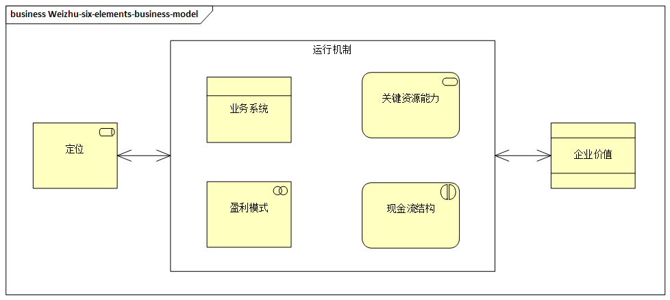
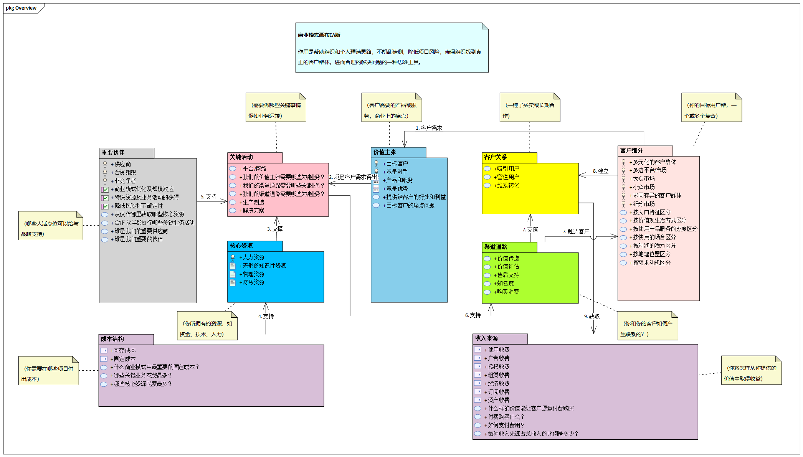
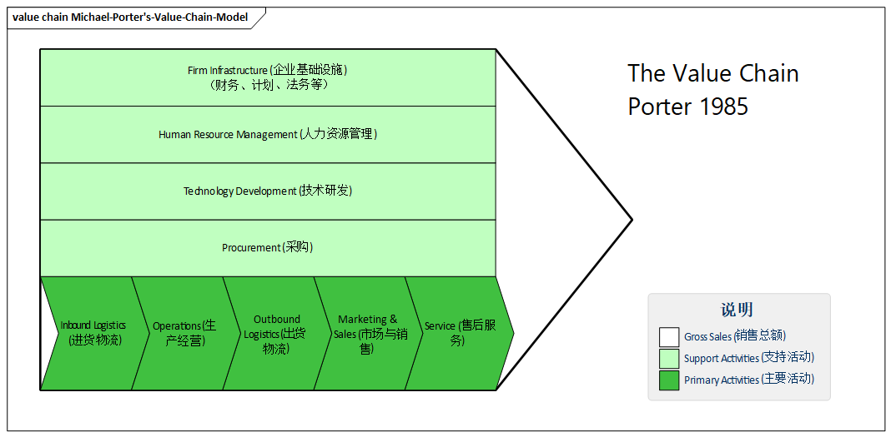
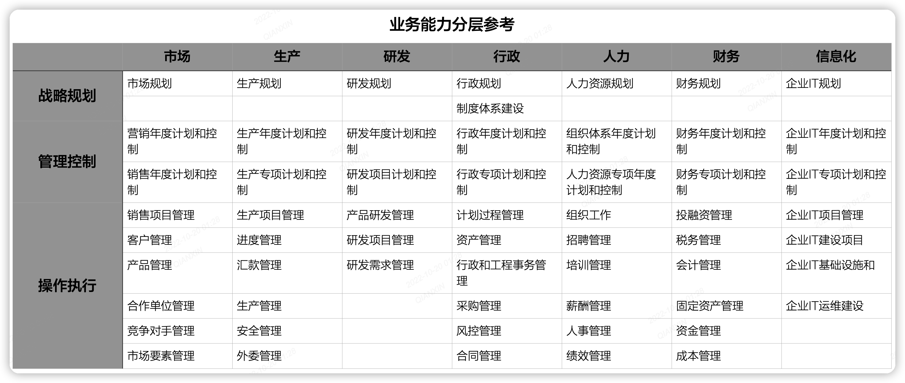

# 业务架构的关键要素

## 商业模式

> 管理大师德鲁克曾说过：“当今企业之间的竞争，不是产品之间的竞争，而是商业模式之间的竞争。”

商业模式本质上是企业战略层面需要考虑的，但由于其对业务架构有着至关重要的作用，我们在此进行分析。

**商业模式是企业生存的“窍门”，可以帮助企业将内外部各要素整合起来，形成一个完整、高效、具有独特核心竞争力的运行系统，从而满足客户需求、实现各利益相关方价值的最大化，最终使企业持续盈利。**

商业模式最核心的三个组成部分是创造价值、传递价值、获取价值，三者是密切相关的环节。

- **创造价值**：基于客户需求，提供价值方案。
- **传递价值**：通过资源配置和相关行动来传递价值。
- **获取价值**：通过一定的盈利模式来持续获取利润。

### 商业模式举例

在互联网和数字化时代，企业尝试突破传统商业模式的束缚，将生产、营销、交易、物流、支付等合为一体，打破时空的限制，并结合移动互联网、大数据、人工智能、云计算等，从根本上改变人们的消费理念和生活方式。同时，新零售也在尝试转型，如线下实体转线上发展，线上电商寻求线下突破。这里我们来看几种典型的电商商业模式。

- `B2C（Business to Customer）`：企业与消费者之间，是电商最普遍的模式，指商业零售，商家直接面向消费者，在线上销售自己的产品和服务。典型的例子如天猫、京东等。
- `B2B（Business to Business）`：企业与企业之间，也就是供应方和采购方之间通过电商作为中间运营者达成产品和服务的交易，解决供应商上游到中游的问题。典型的例子如阿里巴巴等。
- `C2C（Customer to Customer）`：消费者与消费者之间，针对海量商品和类目，做更加个性化的定制，形式与B2C比较接近，更加注重商品品质和服务。典型的例子如淘宝、微店等。
- `C2M（Customer to Manufactory）`：消费者与工厂直接对接，定制化生产和消费。C2M去掉了消费者和制造商之间的品牌商、零售商，更加注重定制服务与增值服务。典型的例子如淘宝特价版、拼多多等。
- `O2O（Online to Offline）`：线上与线下的融合。比如，线上获取信息，引流到线下购买；在线下体验后，将消费者引流到线上下单。这是典型的新零售商业模式，如今很多传统企业在O2O上发力。

**商业模式没有确切的行业标准，因为各个企业的经营之道不同.**

> 就新零售来说，我们可以从多种角度拆分出不同的商业模式。比如:
>
> - 从**交易模式**角度，可以分为直营、分销、寄售等；
> - 从**履约链路**角度，可以分为实时购、次日达等；
> - **从库存的角度**，可以分为预售、共享等；从会员营销角度，可以分为优惠活动、付费会员等；
> - 从**用户体验**角度，可以分为直播、拼团、秒杀等。

### 商业模式分析工具

对于商业模式的分析有很多方法，各个咨询公司（如普华永道、德勤、毕马威、IBM、麦肯锡等）都进行了商业模式分析。商业模式分析是极其专业和复杂的，这里简单介绍两种商业模式分析工具。

#### 魏朱六要素商业模式模型

魏朱六要素商业模式模型是比较典型的商业模式分析工具，其认为商业模式主要包括六个主要要素:

> 图例：魏朱六要素商业模式模型

- **定位**：应该提供什么样的产品和服务来实现客户的价值。定位是企业战略选择的结果，是商业模式分析的起点。
- **业务系统**：达成定位所需要的业务环节，以及相关角色之间合作与交易的方式，业务系统是商业模式的载体。
- **关键资源能力**：使业务系统运转所需要的重要资源和能力。
- **盈利模式**：指企业如何赚取利润，涉及各价值链中利益相关者之间利益的分配方式。
- **现金流结构**：是企业经营过程中产生的现金收入和支出的链条，反映该商业模式的投资价值。
- **企业价值**：是企业的投资价值，是评判企业商业模式优劣的标准。

#### 商业模式画布

商业模式画布应用得非常广泛，最初是由亚历山大·奥斯特瓦德（`Alexander Osterwalder`）提出的，通过商业画布的九宫格，我们可以将企业商业模式可视化，全面分析企业的商业情况。

- **价值主张**：为客户提供什么产品、服务及价值，以及帮助客户解决什么问题？价值主张是企业区别于竞争对手的地方，通过各种元素提供价值，如新颖、性能、定制、把事情做好、设计、品牌、价格、成本、风险低、可达性和可用性等。
- **客户关系**：与客户建立什么样的关系？客户关系包括个人协助、专属服务、自助服务、自动化服务、社区、共同创造等。
- **客户细分**：目标客户群体是谁？根据客户的不同需求和属性，对客户群体进行细分，以满足所选择的客户群体的需求。客户细分群体存在不同的类型，如大众市场、利基市场（特殊需求的小众市场）、区隔化市场、多元市场等。
- **核心资源**：拥有什么核心资源可以保障商业行为的执行？比如，实体资产、知识资产、人力资产、金融资产等。
- **关键活动**：需要做哪些事情才能使得产品和服务能够正常运行？比如，制造产品、解决问题、构建平台和相关的服务网络。
- **渠道通路**：通过什么方式将产品和服务触达客户，使得客户可以为之买单？渠道通路的思考分为五个阶段，包括认知、评估、购买、传递、售后。渠道可以分为自有渠道（如店面）、合作伙伴渠道（如分销商）、自有渠道和合作伙伴渠道的结合，同时从新零售角度还可以分为线上渠道、线下渠道及O2O渠道等。
- **合作伙伴**：主要需要和哪些上游和下游企业深度合作？合作关系分为四种，即战略联盟关系、竞争合作关系、新业务合作关系、供应商和购买方关系。合作的本质是资源的互换，并从合作中共赢。
- **成本结构**：在所有的商业运作过程中是否都考虑了成本？常见的成本结构类型有成本驱动和价值驱动，成本结构需要考虑固定成本、可变成本、规模经济及范围经济。
- **收入来源**：业务的主要收入来源是什么？产生收入的方法有资产出售、使用收费、订阅收费、租赁收费、授权收费、经济收费、广告收费等。

如下面某手机品牌商的商业模式示例：

> 图例：某手机品牌商的商业模式示例

## 价值链

价值链建立在商业模式的基础之上，下面我们进一步分析业务架构的价值链。

> [价值链](https://zh.wikipedia.org/wiki/%E5%83%B9%E5%80%BC%E9%8F%88)是由战略管理学家[迈克尔·波特（Michael Porter）](https://zh.wikipedia.org/wiki/%E8%BF%88%E5%85%8B%E5%B0%94%C2%B7%E6%B3%A2%E7%89%B9)于1985年提出来的，**“每一个企业都是在设计、生产、销售、发送和辅助其产品的过程中进行种种活动的集合体。所有这些活动可以用一个价值链来表明。”**

价值链用于描述从开始到结束创建企业的产品和服务所需的所有业务活动，如采购、设计、生产、销售、服务等。价值链分析为企业提供了可视化模型，以更好地分析这些活动。

> 举个例子，铅笔从原材料到最终使用，涉及木材、石墨芯的获取、加工，以及铅笔的设计、制造、销售等，这些环节都是价值链的一部分。

价值链分析是企业分析自身为创造产品而进行的活动的一种方法，一旦对活动进行了分析，企业就可以利用结果来评估增强竞争优势的方法。企业可以通过提高效率、降低成本、提高差异化等增强竞争优势，为目标市场提供最大价值。

### 价值链分析步骤

**1. 确定业务的主要活动和支持活动**

各种业务相互关联的活动共同构成了价值链，包括从原材料到最终产品所需的每一个环节。具体可以参考后面的“波特价值链分析模型”。

**2. 分析活动的价值和成本**

分析每项活动如何为客户和整个业务提供价值。

**3. 找到获得竞争优势的机会**

完成价值分析后，查看活动的成本，确定哪些活动不具有成本效益，哪些活动可以优化。

### 波特价值链分析模型

> 图例：波特价值链分析模型

在价值链分析理论中，比较典型的是“波特价值链分析模型”。该模型主要分为两个部分：

- **基本活动（纵向）**，一般涉及企业各个业务的部门
  - **供应**：从供应商那里获得材料和资源的方式。
  - **生产**：资源的生产方式，最终产生产品或服务。
  - **交付**：完成后分发的交付过程。
  - **销售**：如何呈现并销售到理想的目标市场。
  - **售后运营**：为客户提供支持，包括对产品的售后、服务和日常运营。
- **支持性活动（横向）**，一般涉及企业的职能部门。
  - **坚实的基础设施**：对财务、计划、法务等做出业务决策和有效地管理资源。
  - **人力资源管理**：管理员工所涉及的所有流程和系统。
  - **研发**：企业产品和服务的研发能力，企业的价值差异所在。
  - **技术**：技术体系发展有助于企业价值链创新。

在企业的核心竞争力分析方面，波特也提供了关于**竞争力的“五力分析”，可以帮助企业选择竞争策略**。波特五力模型在一个简单的模型中汇集了大量不同的因素来分析一个行业的基本竞争格局，主要包括以下五个部分。

- **供应商议价**能力。
- **买方议价**能力。
- **新进入者的威胁**。
- **替代品的威胁**。
- **行业内现有竞争者的竞争**。

此外，在实际工作中，一些企业经常使用SWOT分析法来分析企业的竞争力，将与研究对象相关的内部优势和劣势、外部机会、威胁进行系统分析，从中得出一系列相应的结论。

SWOT的含义如下所示：

- **S(Strengths)** ：优势
- **W(Weaknesses)** :劣势
- **O(Opportunities)** :机会
- **T(Threats)** :威胁

## 业务能力

业务能力代表企业**运行其业务所需要的全部核心能力**，是从**业务视角为实现特定目的或结果而可能拥有或交换的特定能力或产能**。

业务能力需要**尽可能与商业模式和价值链对应起来**。

之所以说业务能力很关键，是因为它**通过业务结果和价值来表达**，从而确保与战略和业务的衔接，与客户旅程和战略场景的外部视角相联系，同时促使业务与IT保持一致。

**业务能力本身比较粗粒度**，可以帮助企业从不同的视角进行业务规划。在[TOGAF](../ea-theory/togaf.md)中，由**角色**、**流程**、**信息**和**工具**的组合可以实现业务能力。

> 在其他理论中，也将业务能力看作一些企业架构概念的分组，包括人、组织、功能、流程、业务服务、信息数据、应用、基础设施，同时映射到企业的项目和解决方案当中。

业务能力可以提供**独立于**当前组织结构、业务流程、应用系统及产品或服务组合的**业务视图**。

在业务架构的体系当中，业务能力最为重要的是把企业业务最核心的业务功能体系化地表现出来。

> 比如，电商常见的业务能力示例，涉及对店铺、商品、会员营销、订单交易、物流库存、结算支付、售后服务等各方面的管理，这些管理所产生的能力就是顶层的业务能力，同时可以分解为多个下层业务能力。
>
> 比如，订单交易可分解为平台订单、自营订单、第三方订单、订单寻源、订单拆分等。

### 业务能力分析方法

业务能力分析方法很多，我们可以从以下方法入手。

- **自上而下**：首先确定最高级别的业务能力，再将各项能力分解为更详细的子能力。这种方法需要强有力的治理和高层的支持。
- **自下而上**：从业务的不同部分定义业务能力，并进行自下而上的归纳构建。这种方法比自上而下的方法耗时多。
- **上下结合**：将自上而下和自下而上的方法相结合，对业务能力模型进行提炼。

无论采用何种方法，分析业务能力均涉及几个重要的信息，如商业模式、价值链、组织结构及当前的业务战略计划。

企业在分析业务能力时要从多种业务维度进行，如预购从支付方式维度、次日达从时间维度、店铺红包从优惠券维度。在业务能力的构建中，企业需要注意以下事项。

- 业务能力的命名最好**采用“名字+动词”的组合方式** 。
- 尝试[MECE分析法](#TODO——添加链接)，即**相互独立，完全穷尽**。
- 确保在堆栈中的每个级别的**粒度都保持在相似的级别**。
- 业务能力需要迭代和持续改进，**不要浪费太多时间在每次迭代上**。
- 试着**在实际的项目情况**下，与其他人一起**对模型做检查**。
- 业务能力可以为企业IT进行能力的梳理，但其**不是解决所有问题的“灵丹妙药”**。
- 业务能力**重点是描述正确的事**，而不是如何去做。
- 业务能力**要有结果，有明确的价值**，但不是具体的流程和价值流。
- 业务能力**要有明确的界定能力**，并且有一定层级关系。
- 业务能力**相互之间要做到能力是唯一**的。
- 业务能力**进一步分解，体现在业务流程的活动级别**。
- 业务能力的**分层是能力的归组关系**，并不是流程分解的关系。

业务在迭代循环中，也可以通过一些指标进行评估，构建业务能力热点映射图，相关的考虑维度可以有以下几点。

- 战略贡献
- 有效性
- 收入贡献
- 成本分摊
- 业务单元覆盖率
- 关键性

### 业务能力分层

业务能力具有分层，**分层是在类别和层次内对业务能力进行分类和分组的过程**。

分层的目的是使业务能力更容易被理解。**各个分层为不同的干系人提供不同的层次**。

> 例如，顶层通常代表战略执行职能，中间层通常代表业务的核心和面向客户的要素，而底层通常将那些后台内部系统能力进行分组。

不同角色关注不同层次的能力。在实践中，业务能力通常被分解为三至六个业务能力级别。

从传统行业的参考模型来看，业务能力可以分为纵向和横向两个维度。

> 图例：业务能力分层参考

- 纵向是职能层次，可分为战略规划、管理控制、操作执行三个层次
- 横向是业务层次，是企业创造价值的能力，涉及市场、生产、研发、行政、人力、财务、信息化等方面

横向的业务类型基本上大家都很熟悉了，主要对纵向的分层进行一些解释。

- **战略规划** ：企业高层管理者负责的范畴。明确战略方向，建立总体的方针和政策等。
- **管理控制** ：企业中层管理者负责的范畴。负责把战略落实到日常的运营当中，监督和管理相关业务和技术指标
- **操作执行** ：进行具体操作的活动和执行动作，注重作业效率和处理能力，通常以任务的形式进行分解

### 业务能力增量

业务能力也有**资产化**的能力，需要**持续迭代和沉淀**，企业可以基于已有的业务能力进行进一步的优化，这就引出了“业务能力增量”的概念。

> 在大多数情况下，**业务能力增量只是改变业务能力的某些方面，而不是引入全新的功能**，同时业务能力增量对应架构治理当中的过渡架构。

> #TODO 图例：业务能力增量

业务能力增量是业务能力的附加部分，对应过渡架构及后续的项目增量。**过渡架构是当前和未来状态架构间的中间形态**。业务能力增量**记录实现业务或IT策略所需的每项业务能力的变更细节**。

业务能力可以分解为一个或多个能力增量。业务能力增量之间**具有依赖性，可能存在先后顺序**。
