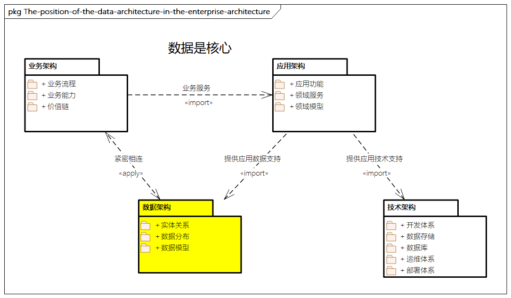

# 数据架构概述

## 什么是数据

一个企业的数字化核心是数据，数据化的价值依赖于数据的标准和质量，数据对一个企业来说至关重要，它也是整个信息化建设及企业架构的核心。数据具有多样性，有结构化的、非结构化的，与业务相关的、与系统相关的，企业内部的、企业外部的等。

**从数据的价值来看，可分为数据本身的和由数据分析产生的**。数据本身并没有太多价值，**重要的是数据进一步带给我们什么**。我们可以从数据中提炼出信息，总结出知识，并可以进一步通过技术来更智能地分析这些数据的深层次价值。这**需要数据思维，一种重视事实、追求数据本质的思维模式**。

## 什么是数据架构

数据架构作为企业架构的重要组成部分，是**连接业务架构与应用架构的纽带**，是企业架构的核心，**主要描述企业架构的数据模型、数据分布、数据资产之间的结构和关系**。

**数据架构涉及数据模型，相关的实体、属性、关系等，以及相关的数据分布和治理。**

数据架构的目的:

- 建立一个标准、统一、通用、共享的公共数据平台
  - 既能够满足业务处理需要
  - 也能够为上层应用提供一个共享、开放的数据访问环境，
- 在此基础上充分分析和挖掘数据的价值，有效地支撑企业数据经营决策

从企业架构的视角来看，数据架构扮演着重要的作用。

> 比如，在Zachman企业架构理论框架:
>
> - 第一列是数据
>   - 第二行是概念数据模型
>   - 第三行是逻辑数据模型
>   - 第四行是物理数据模型
>   - 第五行是数据库定义

> 图例：数据架构在企业架构中的位置

从上图可以看出，数据架构需要对接整个企业架构的数据要求，对应业务架构中业务能力、业务流程、业务活动的数据支撑，以及对应应用架构中领域模型、领域服务和应用功能的数据映射，同时通过技术架构的数据存储、数据库、云原生等技术能力进行数据存储。

**数据架构将领域模型和相应的服务抽象映射到对应的数据模型，并对数据模型中数据项、数据项中的属性、数据项之间的关系进行清晰的定义，构建数据项与应用系统之间的关系，从而实现从业务、应用到数据之间的平稳过渡和紧密关联。**

数据架构需要基于业务架构、应用架构和技术架构，**保持数据的完整性和一致性**。同时，数据架构需要考虑相关的数据技术。

- 比如存储层如何通过技术选型**降低CAPEX（资本性支出）和OPEX（运营成本）等**
- 如何通过数据库中间件和云原生技术架构模式**提高系统的高可用和高并发**
- 如何应用大数据、人工智能、搜索引擎等技术**提升数据分析的价值**
- ......

## 数据架构的价值

数据架构的价值主要体现在以下几个方面。

- 数据架构可以有效地支持企业战略目标和业务架构的落地，发掘企业对数据的诉求。
- 数据架构设计会使业务流程应用系统变得更加流畅，更加易于理解和维护。
- 数据架构描述企业核心的数据资产，进行数据的沉淀。
- 提供数字化转型系统在数字层面的参考，提供相关原则和规范。
- 通过数据思维，为企业各方面利益干系人提供数据管理方法。
- 提供标准、一致、通用、共享的公共数据平台，为不同业务和应用提供友好的共享数据访问能力。