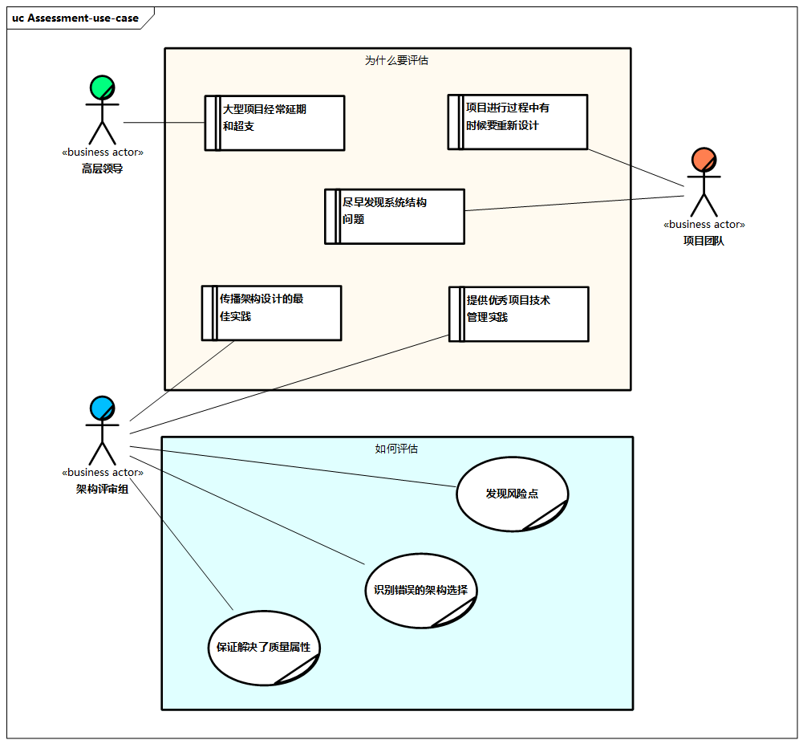
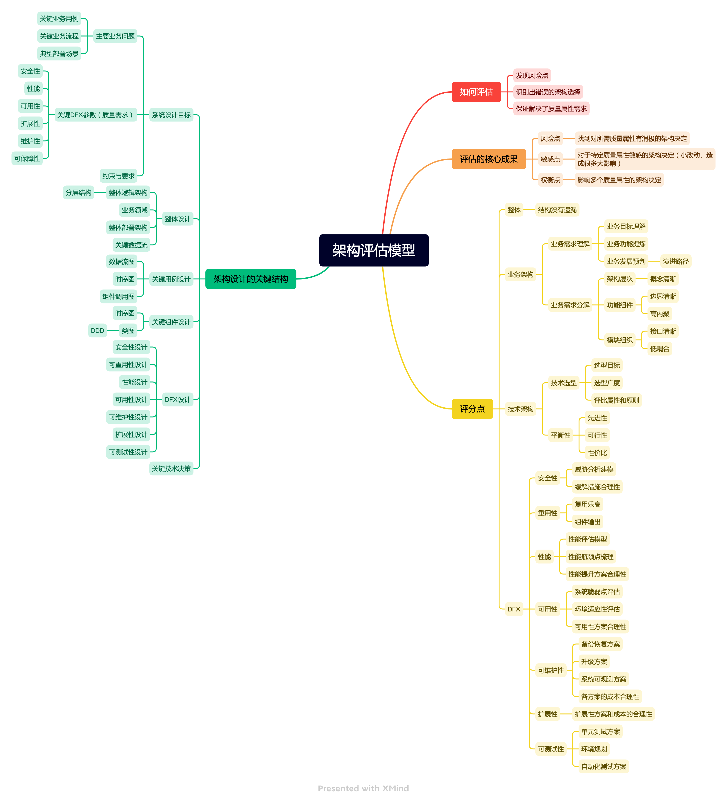
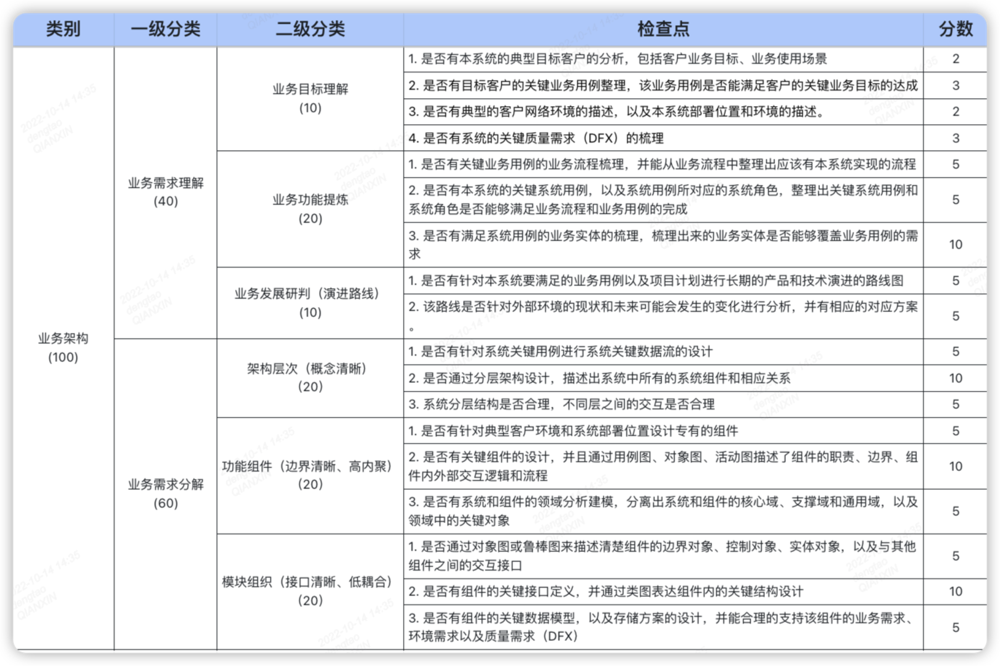

# 架构评估方法

传统软件架构评估方法按评估形式，一般分为三种：

1. **调查问卷法**：即直接请对系统架构了解的专家学者对系统架构做出主观评估。
2. **度量法**：即将软件系统架构完全量化，通过一些客观的数字指标来评估架构的好坏。
3. **场景评估法**：即挑选出重要的系统使用场景(一系列有序的使用或修改系统的步骤，即系统涉众如何使用系统的 )，根据不同场景中各架构的表现分别作评估，`ATAM`和`SAAM`都属于场景评估法，主客观程度介于前面两种方法之间。

> 通常建议可以将“度量法”和“场景评估法”进行结合来评估系统架构。

## 为什么要评估?

1. ⼤型项⽬经常迟交和超支
2. 项目进行过程中有时候要重新设计
3. 能够帮助尽早发现问题，尽早发现的解决成本是很低的
4. 传播架构设计的最佳实践
5. 提供优秀项目技术管理

## 如何评估？

1. 发现风险点
2. 识别出错误的架构选择
3. 保证解决了质量属性

可以帮助涉众(`stakeholder`)去尽早的问出合适的问题来：

1. **找到风险点**：找到对所需质量属性有消极影响的架构决定
2. **找到敏感点**: 对于特定质量属性敏感的架构决定(小改动、造成很大影响)
3. **找到权衡点(`tradeoffs`)**: 影响多个质量属性的架构决定

> 一般相应的问题都有很多成型的方法来解决这个问题，但我们要了解大部分的问题和解决方案都是基于场景进行的，脱离了适合的场景，一般都会不适用。

## 架构评估模型

基于上述原则和架构设计的最佳实践，可以整理出来的架构评估模型如下：

### 架构评分表示例

> 该示例只针对业务架构，不包含技术架构

