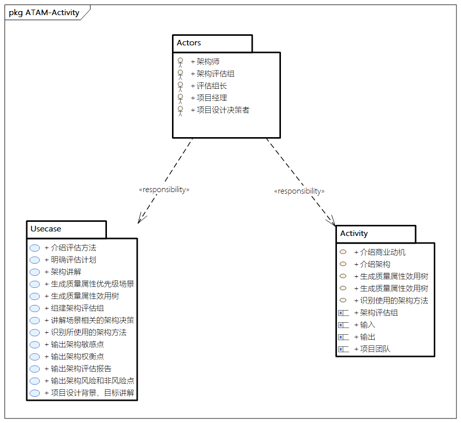
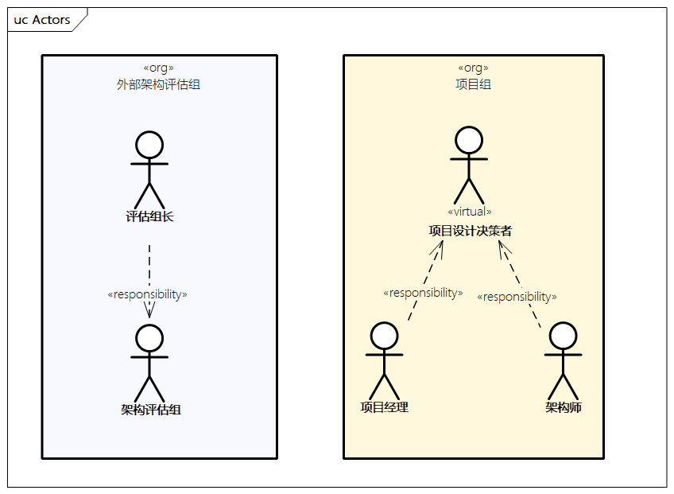
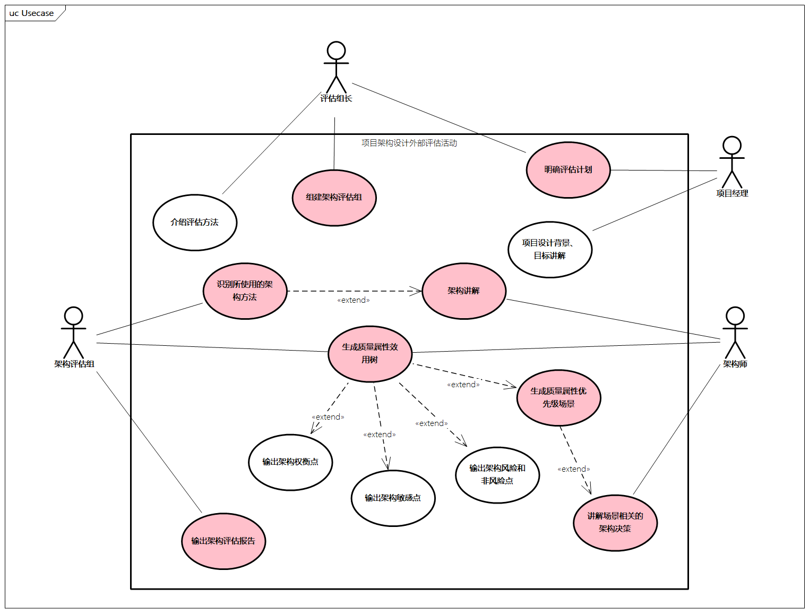
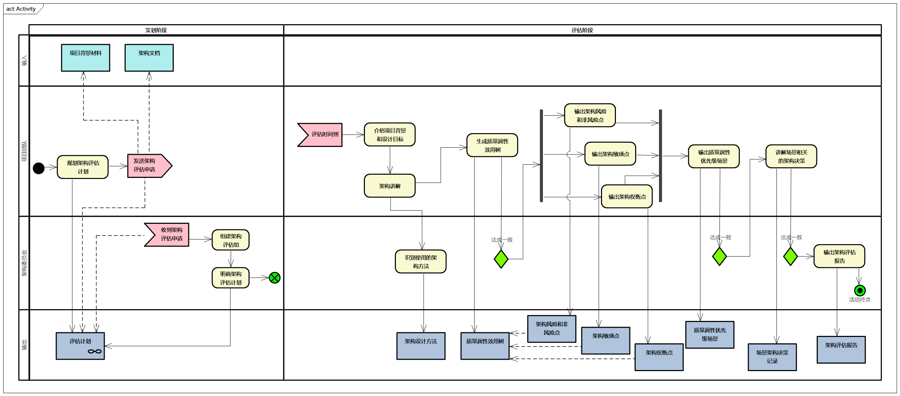

# `ATAM`软件架构评估方法

## ATAM介绍

`ATAM`(`Architecture tradeoff Analysis Method`)是卡梅隆大学软件工程协会提出来的一套架构权衡分析方法。

`ATAM`的评估目的是**根据系统的质量属性和商业需求评估设计决策的结果**。

`ATAM`希望揭示出架构满足特定质量目标的情况，使我们更清楚的认识到**质量目标之间的联系，即如何权衡多个质量目标**。

## `ATAM`评估过程详细描述

### 策略阶段

- **参与者**: 评估组长和关键的项⽬决策者
- **输⼊**:架构文档
- **目标**：确定评估的目标、计划、评估组成员
- **输出**: 评估计划: 谁、什么时间、提供什么样子的评估报告

### 评估阶段

- **参与者**:评估小组和项目设计决策者(肯定包括了项目经理和架构师)
- **输出**: 架构简要展示、业务目标、质量属性和相关场景、效用树、风险和非风险点、敏感点、权衡点

1. 介绍`ATAM`方法(评估小组长)
2. 介绍商业动机(项目经理或系统客户)
3. 介绍架构(首席架构师)
4. 识别使用的架构方法(评估小组)
5. 生成质量属性效用树(评估小组和项目设计决策者) 决定性的一步
6. 分析架构方法(评估小组) 确保方法是正确的 获得风险点、非风险点、敏感点和权衡点列表

### Phase 2:评估(2)

- **参与者**: 评估小组、项目设计决策者和架构涉众
- **输出**: 从涉众群体获得的一个优先级场景列表、风险主题和商业动机

1. 介绍`ATAM`方法和之前的结果(评估小组长) 重复以确保涉众也知道方法并回顾分享之前2~6步的结果
2. 头脑风暴、场景划分优先级(评估小组问涉众) 与质量属性效用树进行比对
3. 分析架构方法(评估小组、架构师) 使用新产生的优先级靠前的场景、架构师解释与之相关的架构决定
4. 展示结果(评估小组)

### Phase 3:后续工作 Follow up

- **参与者**:评估小组和主要涉众
- **输出**:最终的评估报告

### `ATAM` 输出

- 架构简要介绍
- 业务目标
- 以质量属性场景表示的带优先级的质量属性需求
- 效用树
一系列风险点和非风险点
- 风险主题
- 架构决定与质量需求之间的映射
- 敏感点、权衡点
- 最终评估报告

## 带优先级的质量属性效用树

|第2层：质量属性|第3层：质量属性求精|第4层：质量属性场景|重要性|难度|累加和|
|:-:|:-:|:-:|:-:|:-:|:-:|
|可维护性	|M1：对一个子系统的更改不要求改动其他子系统|	M1.1：部署下一个科学数据服务器版本，实现对当前版本的更新。升级应该在8小时以内完成，并且不应影响其他子系统及查找、浏览或预定功能的使用。|	30|	30|	60|
| |M2：独立地回退子系统的部署	|M2.1：使科学数据服务器从M1回退|	20|	20	|40|
|可操作性|	O10：系统应该能在20分钟内根据用户类型、数据类型、介质类型、目的地或用户对1000项定单重新设置优先级	|O10.1：积压任务管理-- 在系统连续24小时不能正常工作后，应在30分钟内为所积压的任务设置优先级，以保证各任务能够按优先级得以处理且正常的操作能够得以维持，不会在恢复正常操作状态后降低吞吐量	|30	|20|	50|
| |O14：应该能在不需要操作干涉的情况下，通过V0网关为1000个并发请求提供服务|O14.1：MODAPS连续24小时不能正常工作，恢复并请求2天的数据；按优先级进行处理 | 20 | 20 | 40 |
| | |O14.2：接收100个并发查询请求，不拒绝高优先级的请求，在性能允许的情况下完成处理，不使系统过载| 20 | 20 | 40 |
|可靠性／可用性| Ra1：失败的或挂起时间超过10分钟的数据输入输出不占用系统资源 |Ra1.1：L-7按预定用FTP方式把数据推到某个FTP服务器已经崩溃的节点，在第一个请求未能成功处理的10分钟内系统被挂起，在请求被挂起期间内所有资源可用，不影响其他节点的分配。| 30  |10|	40|
| 可扩展性|Sc2：系统能够支持50个节点|Sc2.1：跨节点订单可记录50个节点，跨5节点订单历时2分钟。|20|30|50|
| | |Sc2.2：跨节点用户注册在24个小时内经历50个节点。|20|30|50|

## 场景分析表

### 场景描述示例

#### 场景号 M1.1

|要素|描述|
|:--|:--|
|场景（M1.1）|部署下一个科学数据服务器版本，实现对当前版本的更新。升级应该在8小时以内完成，并且不应影响其他子系统及查找、浏览或预定功能的使用。|
|质量属性|可维护性|
|环境|常规维护|
|刺激|部署下一个科学数据服务器版本，实现对当前版本的更新，并添加对经纬度的支持。|
|响应|升级应该在8小时以内完成，并且不应影响其他子系统及查找、浏览或预定功能的使用。|
