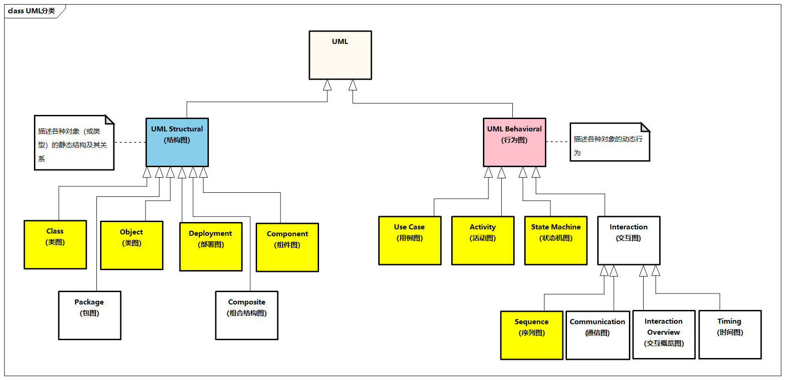
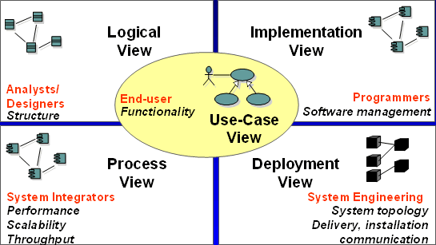
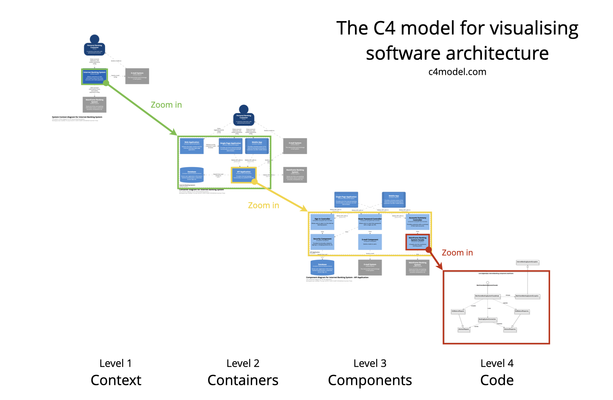

# 技术架构制图

在架构设计领域，架构制图是针对系统架构某一个方面的一种描述，将系统的技术方案、技术选型通过视图的方式进行展现。架构制图可以帮助团队内部和团队之间消除沟通歧义，提升协作效率。一图胜千言，无图无真相。图是直观而形象的，顺应了人类与生俱来的视觉识别本能，一张图所能传达的信息非常多。常见的技术架构制图有功能架构制图、系统分层架构制图、系统链路架构制图、部署架构制图、开发架构制图等。

## 架构制图的原则

国际上对架构描述设立了专门的标准（ISO/IEC/IEEE 42010:2011），架构制图是架构的载体，从制图本身角度，架构制图需要关注以下几个方面。

- **深刻理解制图目标**：架构制图需要有明确的目标，需要准确、完整、清晰、一致、简洁。
- **明确受众及关注点**：比如业务、产品、开发、测试、运维、外部客户、行业专家等。
- **考虑全面，有所侧重**：架构制图需要跳出图本身，全面展示涉及的内容，避免“只见树木，不见森林”；同时需要针对受众和关注点有所侧重，略去与当前视图无关的细节。
- **充分采用设计方法**：建议采用结构化思维，比如金字塔原理、结论先行、以上统下、归纳分组、逻辑递进。
- **采用多种架构视图**：可以采用不同的视图来进行描述，比如从工程制图角度，有主视图、俯视图、左视图等。
- **遵守统一的图例规范**：比如UML中泛化、聚合、组合、依赖等关系的表达，以及各种方框、虚实线、箭头的含义，特别是组件之间的交互方式，比如同步或异步。
- **持续优化迭代**：与软件一样，架构制图也有版本，核心是表达清楚图的内容，突出最重要的地方，架构制图的粒度、类别、内容等可以逐步完善。

## 架构制图的方法

### UML

UML（Unified Modeling Language）是统一建模语言的简称，它是一种由一整套图表组成的标准化建模语言。UML用于帮助系统开发人员记录软件系统的产出。UML主要使用图形符号来表示软件项目的设计，帮助项目团队沟通和进行软件设计。

UML总共包含十几种不同类型的图，可以覆盖软件设计领域各种制图需求，主要分为如下两大类图。

> 图例: UML分类

- **结构图（Structural Diagrams）**：通过对象、属性、操作和关系等，强调系统的静态结构，包括类图（Class Diagram）、组件图（Component Diagram）、部署图（Deployment Diagram）、对象图（Object Diagram）、包图（Package Diagram）、组合结构图（Composite Structure Diagram）。
- **行为图（Behavioral Diagrams）**：通过展示对象之间的协作关系及对象内部的状态改变，强调系统的动态行为，包括用例图（Use Case Diagram）、活动图（Activity Diagram）、序列图（Sequence Diagram）、状态机图（State Machine Diagram）、通信图（Communication Diagram）、交互概述图（Interaction Overview Diagram）、时序图（Timing Diagram）。

下面简单介绍几种常用的UML制图。

- **类图（Class Diagram）**：类图是一切面向对象的核心建模工具，描述系统中对象的类型及它们之间存在的各种静态关系。
- **组件图（Component Diagram）**：组件图描述组件如何连接在一起以形成更大的组件或软件系统。它展示了软件组件的体系结构及它们之间的依赖关系。
- **用例图（Use Case Diagram）**：用例图从用例的角度描述系统的功能需求，它是系统预期功能（用例）及其环境（参与者）的模型。
- **活动图（Activity Diagram）**：活动图用于展示工作流程，它支持选择 （Choice）、迭代（Iteration）和并发（Concurrency）。活动图描述目标系统的业务流程。
- **状态机图（State Machine Diagram）**：状态机图描绘允许的状态和转换，以及影响这些转换的事件，有助于可视化对象的生命周期管理。
- **序列图（Sequence Diagram）**：序列图根据时间序列展示对象如何进行协作。它展示了在用例的特定场景中，对象如何与其他对象进行交互。

对于通用的一些UML原则，[《码出高效：Java开发手册》](https://m.douban.com/book/subject/30333948/)给出了比较详细的介绍，这里挑选并提炼其中几条。

- 在需求分析阶段，如果与系统交互的对象超过一类并且相关的用例超过5个，则使用用例图来表达更加清晰的结构化需求。
- 如果某个业务对象的状态超过3个，则使用状态机图来表达并且明确状态变化的各个触发条件。
- 如果系统中某个功能的调用链路上涉及的对象超过3个，则使用时序图来表达并且明确各调用环节的输入与输出。
- 如果系统中模型类超过5个，并且存在复杂的依赖关系，则使用类图来表达并且明确各类之间的关系。
- 如果系统中超过2个对象之间存在协作关系，并且需要表示复杂的处理流程，则用活动图来表示。
- 谨慎使用继承的方式进行扩展，优先使用聚合或组合的方式。
- 在进行系统设计时，根据依赖倒置原则，尽量依赖抽象类与接口，这样有利于扩展与维护，需要注意的是，应对扩展开放，对修改闭合。
- 在系统设计阶段，共性业务或公共行为抽取出来公共模块、公共配置、公共类、公共方法等，避免出现重复代码或重复配置的情况。

### “4+1”视图模型

1995年，Philippe Kruchten发表了题为“The 4+1 View Model of Architecture”的论文，引起了业界的关注。此论文提出了一种用来描述软件系统体系架构的模型，以架构为中心场景驱动和迭代开发等方式实现设计。“4+1”视图模型基于不同项目干系人，从4种基础视图和场景方面来描述软件需求。

> 图例：“4+1”视图模型

- **场景（Scenarios）**：场景用于描述系统的参与者与功能用例间的关系，反映系统的最终需求和交互设计，通常用用例图表示。
- **逻辑视图（Logical View）**：逻辑视图用于描述系统软件功能拆解后的组件关系，反映系统整体组成与系统构建过程，通常用组件图和类图表示。
- **物理视图（Physical View）**：物理视图用于描述系统软件到物理硬件的映射关系，反映系统的组件部署关系，通常用部署图表示。
- **流程视图（Process View）**：流程视图用于描述系统软件组件之间的通信时序、数据的输入和输出，反映系统的功能流程与数据流程，通常用时序图和活动图表示。
- **开发视图（Development View）**：开发视图用于描述系统的模块划分和组成，以及细化到内部包的组成设计，反映系统开发实施过程，通常用组件图和包图表示。

## C4模型

C4模型来自[《程序员必读之软件架构》（Software Architecture for Developers）](https://item.jd.com/10026523364580.html)一书，C4模型是一种“抽象优先”的架构制图方法，它是受[UML](#uml)的启发而开发出来的，但相对而言，C4模型更加简单和轻量，只包含少量的一组抽象和图表，易于学习和使用，如图7-4所示。

> 图例：C4模型示意图

C4代表**上下文（Context）**、**容器（Container）**、**组件（Component）**和**代码（Code）**分层的图表，可以用这些图表来描述不同缩放级别的软件架构，每种图表适用于不同的受众。

C4模型最关键的思想就是自上而下对系统的静态结构进行逐级拆分，依次描述各层次对象的职责、关系和外部依赖。此外，它还可以包含动态视图、部署视图等补充视图。举个例子，一个软件系统由多个容器（如数据库、应用）组成，一个容器由多个组件组成（如微服务和技术组件），一个组件由多个代码（如接口类、实现类、领域对象类）结构组成。
